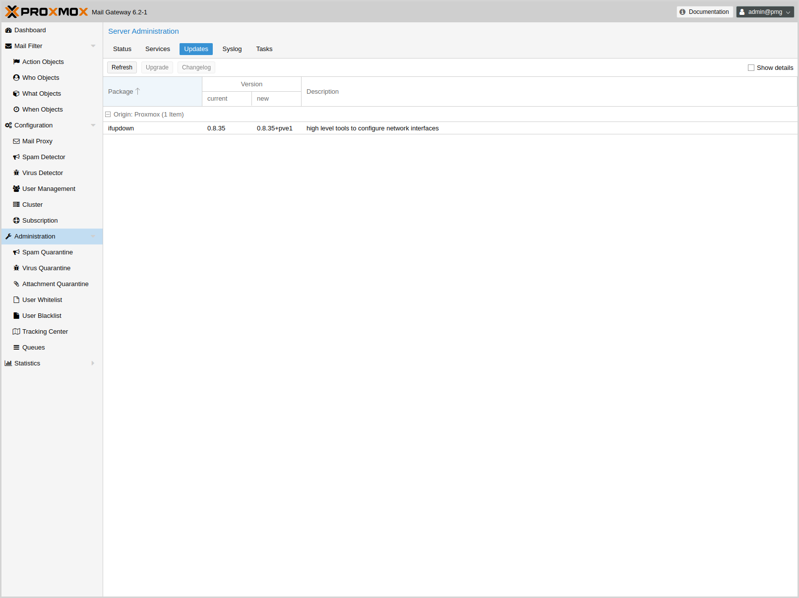
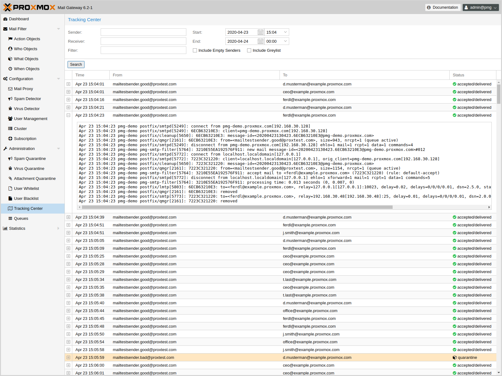

Administration
==============

The Administration GUI allows you to do common administration tasks
like updating software packages, manage quarantine, view service
status and manage mail queues. It also provides server statistics in
order to verify server health.

Server Administration
---------------------

Server status
~~~~~~~~~~~~~

image::images/screenshot/pmg-gui-server-status.png[]

This page shows server statistics about CPU, memory, disk and network
usage. You can select the displayed time span on the upper right.

Administrators can open a terminal window using the 'Console'
button. It is also possible to trigger a server 'Restart' or
'Shutdown'.

Services
~~~~~~~~

image::images/screenshot/pmg-gui-service-status.png[]

This panel lists all major services used for mail processing and
cluster synchronization. If necessary, you can start, stop or restart
them. The 'Syslog' button shows the system log filtered for the
selected service.

Please note that {pmg} uses {systemd} to manage services, so you can
also use the standard `systemctl` command line tool to manage or view
service status, for example:

-----
systemctl status postfix
-----

Updates
~~~~~~~

We release software updates on a regular basis, and it is recommended
to always run the latest available version. This page shows the
available updates, and administrator can run an upgrade by pressing
the 'Upgrade' button.

See section xref:pmg_package_repositories[Package Repositories] for
details abaout available package repositories.

Syslog and Tasks
~~~~~~~~~~~~~~~~

image::images/screenshot/pmg-gui-syslog.png[]

The syslog page gives you a quick real-time log view. Please use the
xref:pmg_tracking_center[Tracking Center] to search the logs.

Quarantine
----------

Spam
~~~~

DODO

Virus
~~~~~

TODO

User White- and Blacklist
~~~~~~~~~~~~~~~~~~~~~~~~~

TODO

[[pmg_tracking_center]]
Tracking Center
---------------

Email processing is a complex task and involves several service
daemons. Each daemon logs information to the syslog service. The
problem is that a servers analyzes many emails in parallel, so it is
usually very hard to find all logs corresponding to a specific mail.

Introduced in {pmg} 2.1, the tracking center simplifies the search for
emails dramatically. We use highly optimized C-code to search the
available syslog data. This is very fast and powerful, and works for
sites processing several million emails per day.

The result is a list of received mails, including the following data:

[cols="s,5d"]
|====
|Time | Timestamp of first found syslog entry.
|From | Envelope 'From' address (the sender).
|To   | The email receiver address.
|Status | Delivery status.
|Syslog | The corresponding syslog entries are shown if you double click such
entry, or if you press the '+' button on the left.
|====

Please notice that you can specify filters, most important you can set
a 'Start' and 'End' time. By default the start time is set to one hour
ago. If you still get to much result entries, you can try to restrict
the search to specific sender or receiver addresses, or search for a
specific text in the logs ('Filter' entry).

Postfix Queue Administration
----------------------------

TODO
