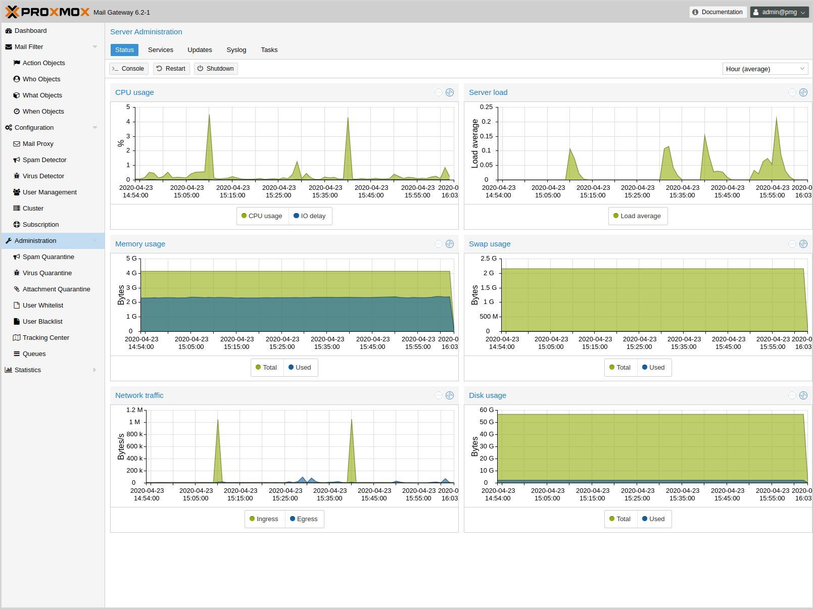
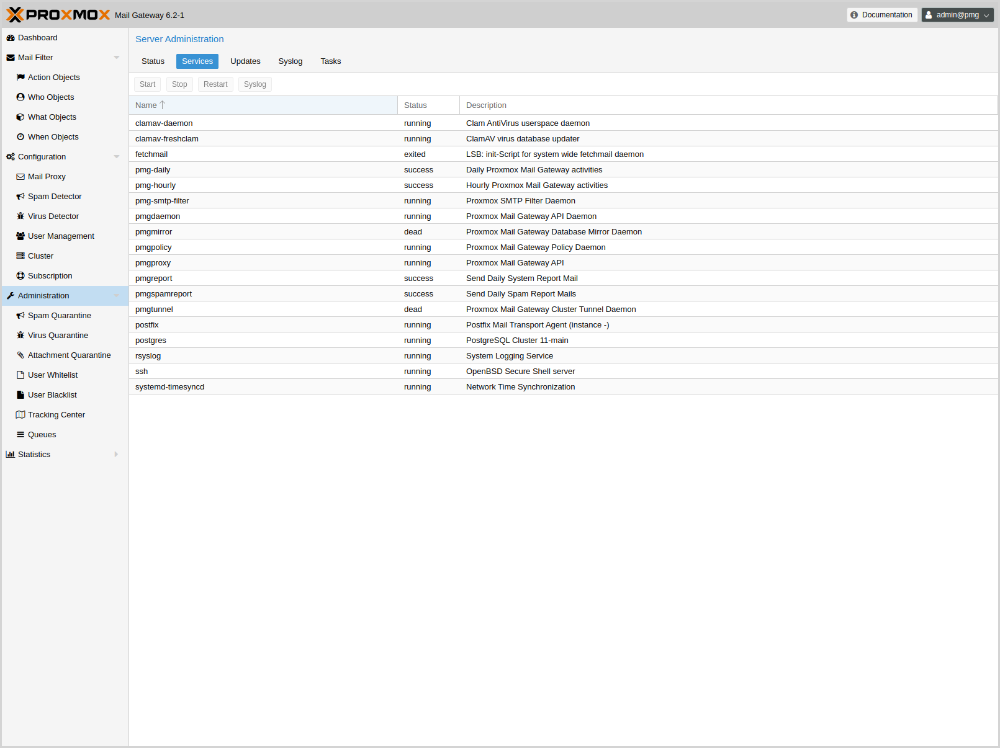
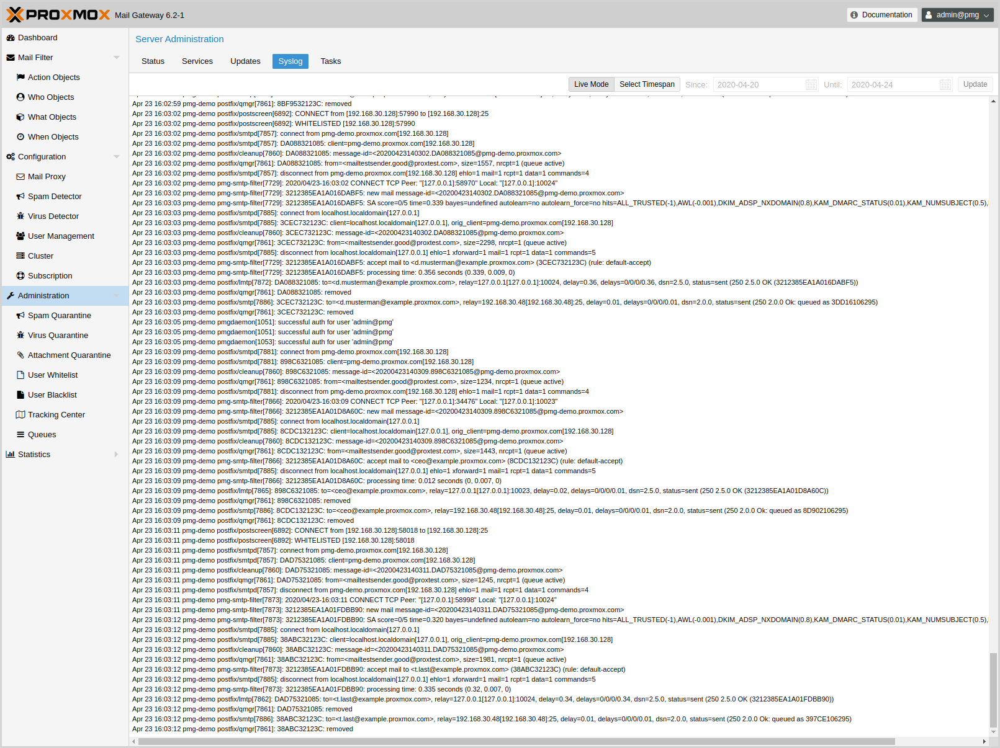

Administration
==============

The Administration GUI allows you to do common administration tasks
like updating software packages, manage quarantine, view service
status and manage mail queues. It also provides server statistics in
order to verify server health.

Server Administration
---------------------

Server status
~~~~~~~~~~~~~

This page shows server statistics about CPU, memory, disk and network
usage. You can select the displayed time span on the upper right.

Administrators can open a terminal window using the 'Console'
button. It is also possible to trigger a server 'Restart' or
'Shutdown'.

Services
~~~~~~~~

This panel lists all major services used for mail processing and
cluster synchronization. If necessary, you can start, stop or restart
them. The 'Syslog' button shows the system log filtered for the
selected service.

Please note that {pmg} uses {systemd} to manage services, so you can
also use the standard `systemctl` command line tool to manage or view
service status, for example:

-----
systemctl status postfix
-----

Updates
~~~~~~~

image::images/screenshot/pmg-gui-updates.png[]

We release software updates on a regular basis, and it is recommended
to always run the latest available version. This page shows the
available updates, and administrator can run an upgrade by pressing
the 'Upgrade' button.

See section xref:pmg_package_repositories[Package Repositories] for
details abaout available package repositories.

Syslog and Tasks
~~~~~~~~~~~~~~~~

TODO

Quarantine
----------

Spam
~~~~

DODO

Virus
~~~~~

TODO

User White- and Blacklist
~~~~~~~~~~~~~~~~~~~~~~~~~

TODO

Tracking Center
---------------

TODO

Postfix Queue Administration
----------------------------

TODO
