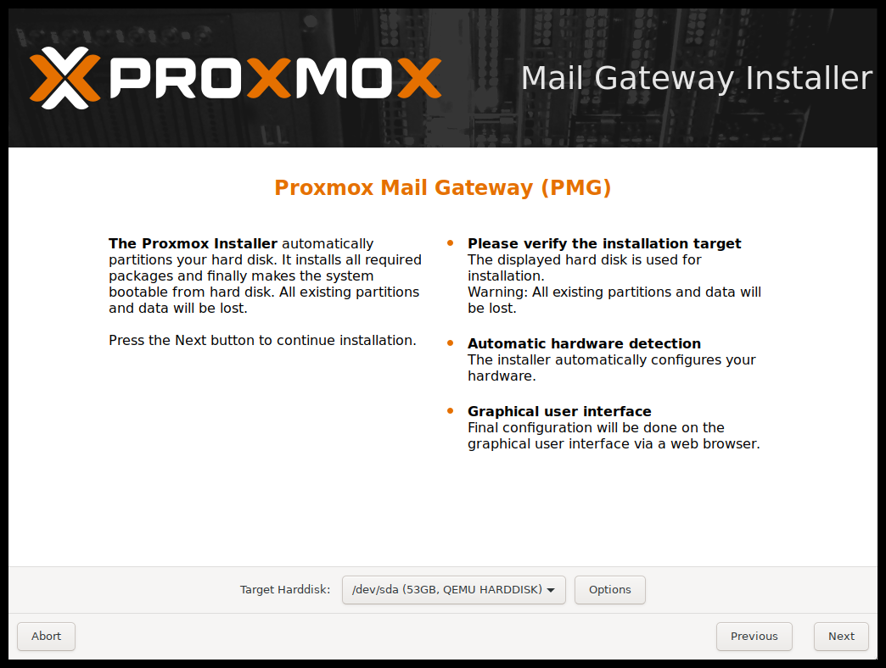
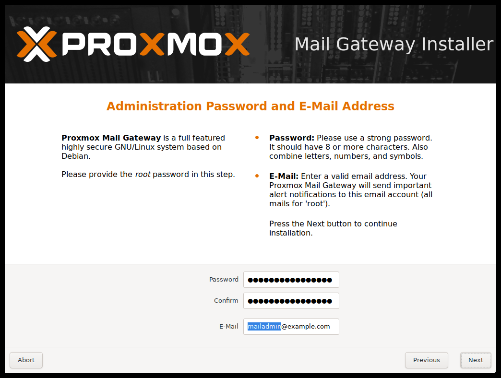
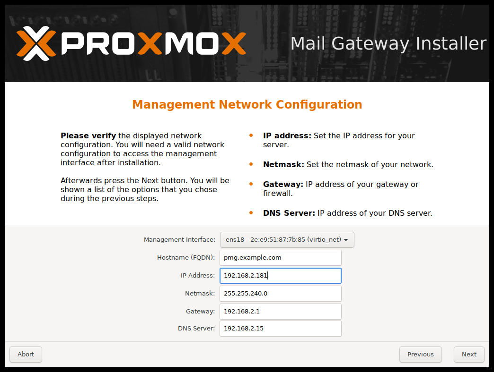

Installation
============

{pmg} is based on Debian and comes with an installation CD-ROM
which includes a complete Debian ("stretch" for version 5.x) system as
well as all necessary {pmg} packages.

The installer just asks you a few questions, then partitions the local
disk(s), installs all required packages, and configures the system
including a basic network setup. You can get a fully functional system
within a few minutes. This is the preferred and recommended
installation method.

Alternatively, {pmg} can be installed on top of an existing Debian
system.  This option is only recommended for advanced users since
it requires more detailed knowledge about {pmg} and Debian.

Using the {pmg} Installation CD-ROM
-----------------------------------

You can download the ISO from http://www.proxmox.com. It includes the
following:

* Complete operating system (Debian Linux, 64-bit)

* The {pmg} installer, which partitions the hard drive(s) with ext4,
  ext3, xfs or ZFS and installs the operating system.

* Linux kernel

* Postfix MTA, ClamAV, Spamassassin and the {pmg} toolset

* Web based management interface for using the toolset

Please burn the downloaded ISO image to a CD or create a
xref:create_bootable_usb[bootable USB stick].

Then insert the installation CD-ROM on the physical host where you want
to install {pmg} and boot from that drive. Immediately afterwards you
can choose the following menu options:

Install {pmg}::

Start normal installation.

Install {pmg} (Debug mode)::

Start installation in debug mode. It opens a shell console at several
installation steps, so that you can debug things if something goes
wrong. Please press `CTRL-D` to exit those debug consoles and continue
installation. This option is mostly for developers and not meant for
general use.

Rescue Boot::

This option allows you to boot an existing installation. It searches
all attached hard disks and, if it finds an existing installation,
boots directly into that disk using the existing Linux kernel. This
can be useful if there are problems with the boot block (grub), or the
BIOS is unable to read the boot block from the disk.

Test Memory::

Runs `memtest86+`. This is useful to check if your memory is
functional and error free.

You normally select *Install {pmg}* to start the installation.

First step ist to read our EULA (End User License Agreement). After
that you get prompted to select the target hard disk(s).

NOTE: By default, the complete server is used and all existing data is
removed.

The `Options` button lets you select the target file system, which
defaults to `ext4`. The installer uses LVM if you select `ext3`,
`ext4` or `xfs` as file system, and offers additional option to
restrict LVM space (see <<advanced_lvm_options,below>>)

If you have more than one disk, you can also use ZFS as file system.
ZFS supports several software RAID levels, so this is specially useful
if you do not have a hardware RAID controller. The `Options` button
lets you select the ZFS RAID level, and you can choose disks there.

The next page just ask for basic configuration options like your
location, the time zone and keyboard layout. The location is used to
select a download server near you to speedup updates. The installer is
usually able to auto detect those setting, so you only need to change
them in rare situations when auto detection fails, or when you want to
use some special keyboard layout not commonly used in your country.

You then need to specify an email address and the superuser (root)
password. The password must have at least 5 characters, but we highly
recommend to use stronger passwords - here are some guidelines:

- Use a minimum password length of 12 to 14 characters.

- Include lowercase and uppercase alphabetic characters, numbers and symbols.

- Avoid character repetition, keyboard patterns, dictionary words, letter or number sequences, usernames, relative or pet names, romantic links (current or past) and biographical information (e.g., ID numbers, ancestors' names or dates).

It is sometimes necessary to send notification to the system
administrator, for example:

- Information about available package updates.

- Error messages from periodic CRON jobs.

All those notification mails will be sent to the specified email
address.

The last step is the network configuration. Please note that you can
use either IPv4 or IPv6 here, but not both. If you want to configure a
dual stack node, you can easily do that after installation.

If you press `Next` now, installation starts to format disks, and
copies packages to the target.

Copying packages usually takes a few minutes. Please wait until that
is finished, then reboot the server.

Further configuration is done via the Proxmox web interface. Just
point your browser to the IP address given during installation
(https://youripaddress:8006).

. Login and upload subscription key.
+
NOTE: Default login is "root" and the root password is
defined during the installation process.

. Check the IP configuration and hostname.

. Check and save the Time Zone.

. Check your xref:firewall_settings[Firewall settings].

. Configure {pmg} to forward the incoming SMTP traffic to your Mail
server ('Configuration/Mail Proxy/Default Relay') - 'Default
Relay' is your e-mail server.

. Configure your e-mail server to send all outgoing messages through
your {pmg} ('Smart Host', port 26 by default) - see
xref:fitering_outgoing_mail[Filtering outgoing e-mails].

For detailed deployment scenarios see chapter
xref:chapter_deployment[Planning for Deployment].

If the installation succeeds you have to route all your incoming and
outgoing e-mail traffic to the Mail Gateway. For incoming traffic you
have to configure your firewall and/or DNS settings. For outgoing
traffic you need to change the existing e-mail server configuration.

[[advanced_lvm_options]]
Advanced LVM Configuration Options
~~~~~~~~~~~~~~~~~~~~~~~~~~~~~~~~~~

The installer creates a Volume Group (VG) called `pmg`, and additional
Logical Volumes (LVs) called `root` and `swap`. The size of
those volumes can be controlled with:

`hdsize`::

Defines the total HD size to be used. This way you can save free
space on the HD for further partitioning (i.e. for an additional PV
and VG on the same hard disk that can be used for LVM storage).

`swapsize`::

Defines the size of the `swap` volume. The default is the size of the
installed memory, minimum 4 GB and maximum 8 GB. The resulting value cannot
be greater than `hdsize/8`.

`minfree`::

Defines the amount of free space left in LVM volume group `pmg`.
With more than 128GB storage available the default is 16GB, else `hdsize/8`
will be used.
+
NOTE: LVM requires free space in the VG for snapshot creation (not
required for lvmthin snapshots).

ZFS Performance Tips
~~~~~~~~~~~~~~~~~~~~

ZFS uses a lot of memory, so it is best to add additional RAM if you
want to use ZFS. A good calculation is 4GB plus 1GB RAM for each TB
RAW disk space.

ZFS also provides the feature to use a fast SSD drive as write cache. The
write cache is called the ZFS Intent Log (ZIL). You can add that after
installation using the following command:

 zpool add <pool-name> log </dev/path_to_fast_ssd>

Install {pmg} on Debian
-----------------------

{pmg} ships as a set of Debian packages, so you can install it
on top of a normal Debian installation. After configuring the
repositories, you need to run:

[source,bash]
----
apt-get update
apt-get install proxmox-mailgateway
----

Installing on top of an existing Debian installation looks easy, but
it presumes that you have correctly installed the base system, and you
know how you want to configure and use the local storage. Network
configuration is also completely up to you.

NOTE: In general, this is not trivial, especially when you use LVM or
ZFS.
