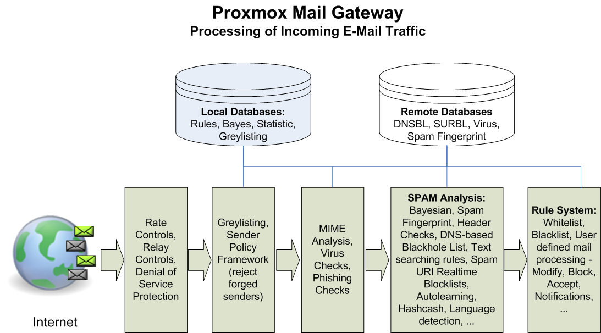

Introduction
============

What is {pmg}?
--------------

E-mail security begins at the gateway by controlling all incoming and
outgoing e-mail messages. {pmg} addresses the full spectrum of
unwanted e-mail traffic, focusing spam and virus detection. {pmg}
provides a powerful and affordable server solution to eliminate spam,
viruses and blocking undesirable content from your e-mail system. All
products are self-installing and can be used without deep knowledge of
Linux.

Your benefit with {pmg}
-----------------------

* Open source software
* No vendor lock-in
* Linux kernel
* Fast installation and easy-to-use
* Web-based management interface
* REST API
* Huge active community
* Low administration costs and simple deployment

include::getting-help.adoc[]
