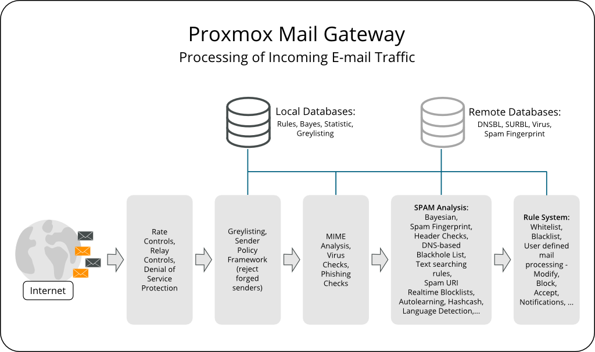

Introduction
============

What is {pmg}?
--------------

E-mail security begins at the gateway by controlling all incoming and
outgoing e-mail messages. {pmg} addresses the full spectrum of
unwanted e-mail traffic, focusing spam and virus detection. {pmg}
provides a powerful and affordable server solution to eliminate spam,
viruses and blocking undesirable content from your e-mail system. All
products are self-installing and can be used without deep knowledge of
Linux.

Features
--------

Spam detection
~~~~~~~~~~~~~~

{pmg} uses a wide variety of local and network tests to identify spam
mail. Here is a short list of used filtering methods:

Receiver Verification::

Many of the junk messages reaching your network are emails to
non-existent users. {pmg} detects these emails on SMTP
level, which means before they are transferred to your networks. This
reduces the traffic to be analyzed for spam and viruses up to 90% and
reduces the working load on your mail servers and scanners.

Sender policy framework (SPF)::

Sender Policy Framework (SPF) is an open standard for validating
emails and to prevent sender IP address forgery. SPF allows the
administrator of an Internet domain to specify which computers are
authorized to send emails with a given domain by creating a specific
SPF record in the Domain Name System (DNS).

DNS-based Blackhole List::

A DNS-based Blackhole List (DNSBL) is a means by which an Internet
site may publish a list of IP addresses, in a format which can be
easily queried by computer programs on the internet. The technology is
built on top of the Domain Name System. DNSBLs are used to publish
lists of addresses linked to spamming.

SMTP Whitelist::

Exclude senders from SMTP blocking. To prevent all SMTP checks
(Greylisting, Receiver Verification, SPF and RBL) and accept all
e-mails for the analysis in the filter rule system, you can add the
following to this list: Domains (Sender/Receiver), Mail address
(Sender/Receiver), Regular Expression (Sender/Receiver), IP address
(Sender), IP network (Sender)

Bayesian Filter - Automatically trained statistical filters::

Some particular words have a higher probability of occurring in spam
emails rather than in legitimate emails. By being trained to
recognize those words, the Bayesian checks every email and adjusts the
probabilities of it being a spam word or not in its database. This is
done automatically.

Black- and Whitelists::

Black- and Whitelists are an access control mechanism to accept,
block, or quarantine emails to recipients. This allows you to tune the
rule-system by applying different objects like domains, email address,
regular expression, IP Network, LDAP Group, and others.

Autolearning algorithm::

{pmg} gathers statistical information about spam
emails. This information is used by an autolearning algorithm, so the
system becomes smarter over time.

Spam Uri Realtime BlockList (SURBL)::

SURBLs are used to detect spam based on message body URIs (usually web
sites). This makes them different from most other Real-time
Blocklists, because SURBLs are not used to block spam senders. SURBLs
allow you to block messages that have spam hosts which are mentioned
in message bodies.

Greylisting::

Greylisting an email from a sender your system does not recognize,
means, that it will be temporarily rejected. Since temporary failures
are built into the RFC specifications for mail delivery, a legitimate
server will try to resend the email later on. This is an effective
method because spammers do not queue and reattempt mail delivery as is
normal for a regular Mail Transport Agent.
+
Greylisting can reduce e-mail traffic up to 50%. A greylisted email
never reaches your mail server and thus your mail server will not send
useless "Non Delivery Reports" to spammers.

SMTP Protocol Tests::

{postfix} is able to do some sophisticated SMTP protocol tests (see
`man postscreen`). Most spam is sent out by zombies (malware on
compromised end-user computers), and those zombies often try to
maximize the amount of mails delivered. In order to do that, many of
them violate the SMTP protocol specification and thus can get detected
by these tests.

Before and After Queue Filtering::

{pmg} can be configured to either accept the mail, by sending a response
of '250 OK', and scan it afterwards, or alternatively inspect the mail
directly after it has the content and respond with a reject '554' if the
mail is blocked by the rule system. These options are known as After Queue
and Before Queue filtering respectively (see
xref:pmgconfig_mailproxy_before_after_queue[Before and After Queue Scanning]).

Configurable NDR policy::

In certain environments it can be unacceptable to discard an email, without
informing the sender about that decision. You can decide whether you want
to inform the senders of blocked emails or not.

Virus detection
~~~~~~~~~~~~~~~

{pmg} integrates {clamav}, which is an open-source (GPL) antivirus
engine designed for detecting Trojans, viruses, malware and other
malicious threats.

It provides a high performance mutli-threaded scanning daemon, command
line utilities for on demand file scanning, and an intelligent tool
for automatic signature updates.

Object-Oriented Rule System
~~~~~~~~~~~~~~~~~~~~~~~~~~~

The object-oriented rule system enables custom rules for your
domains. It’s an easy but very powerful way to define filter rules by
user, domains, time frame, content type and resulting action. {pmg}
offers a lot of powerful objects to configure your own custom system.

WHO - objects::

Who is the sender or receiver of the e-mail?

WHAT - objects::

What is in the e-mail?

WHEN - objects::

When is the e-mail received by {pmg}?

ACTIONS - objects::

Defines the final actions.

Every rule has five categories FROM, TO, WHEN, WHAT and ACTION. Every
of these categories can contain several objects and a direction (in,
out or both).

Options range from simple spam and virus filter setups to
sophisticated, highly customized configurations blocking certain types
of e-mails and generating notifications.

Spam Quarantine
~~~~~~~~~~~~~~~

Identified Spam mails can be stored to the user-accessible Spam
quarantine. Thus, users can view and manage their Spam mails by
themselves.

Tracking and Logging
~~~~~~~~~~~~~~~~~~~~

The innovative Proxmox Message Tracking Center tracks and summarizes
all available logs. With the web-based and user-friendly management
interface, IT admins can easily overview and control all
functions from a single screen.

The Message Tracking Center is very fast and powerful, tested on {pmg}
sites processing over a million emails per day. All different log
files from the last 7 days can be queried and the results are
summarized by an intelligent algorithm.

The logged information includes:

- Arrival of the email
- Proxmox filtering processing with results
- Internal queue to your email server
- Status of final delivery

DKIM Signing
~~~~~~~~~~~~

{pmg} offers the possibility to optionally sign outgoing emails with
xref:pmgconfig_mailproxy_dkim[DKIM].

High Availability with Proxmox HA Cluster
~~~~~~~~~~~~~~~~~~~~~~~~~~~~~~~~~~~~~~~~~

To provide a 100% secure email system for your business, we developed
Proxmox High Availability (HA) Cluster. The Proxmox HA Cluster uses a
unique application level clustering scheme, which provides extremely
good performance. Fast set-up within minutes and a simple, intuitive
management keep resource needs low. After temporary failures, nodes
automatically reintegrate without any operator interaction.

LDAP integration
~~~~~~~~~~~~~~~~

It is possible to query user and group data from LDAP servers. This
may be used to build special filter rules, or just to provide
authentication services for the Spam quarantine GUI.

Fetchmail integration
~~~~~~~~~~~~~~~~~~~~~

{pmg} allows you to fetch mail from other IMAP or POP3 servers.

Flexible User Management
~~~~~~~~~~~~~~~~~~~~~~~~

The administration interface uses a role-based access control scheme,
using the following roles:

Superuser::

This role is allowed to do everything (reserved for user 'root').

Administrator::

Full access to mail filter setup, but not allowed to change network setup.

Quarantine Manager::

Is able to view and manage the Spam Quarantine.

Auditor::

Has read-only access to the whole configuration, can access logs and
view statistics.

Your benefit with {pmg}
-----------------------

* Open source software
* No vendor lock-in
* Linux kernel
* Fast installation and easy-to-use
* Web-based management interface
* REST API
* Huge active community
* Low administration costs and simple deployment

include::getting-help.adoc[]
