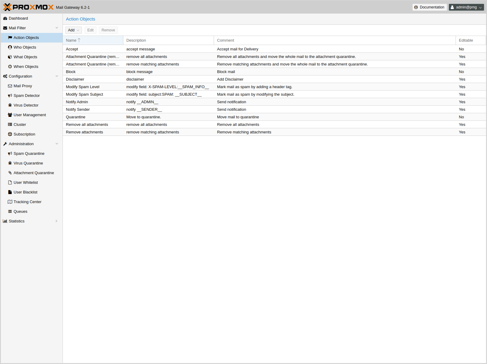
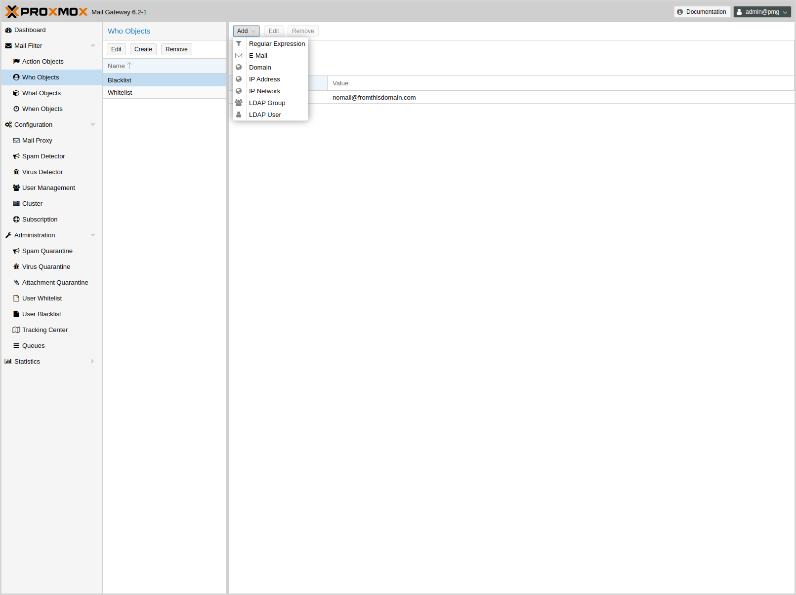

Mail Filter
===========

{pmg} ships with a highly configurable mail filter. It’s an easy but
powerful way to define filter rules by user, domains, time frame,
content type and resulting action.

Every rule has 5 categories ('FROM', 'TO', 'WHEN', 'WHAT' and
'ACTION'), and each category may contain several objects to match
certain criteria:

WHO - objects::

Who is the sender or receiver of the e-mail? Those objects can be used
for the 'TO' and/or 'FROM' category.
+
====
Example: EMail-object - Who is the sender or receiver of the e-mail?
====

WHAT - objects::

What is in the e-mail?
+
====
Example: Does the e-mail contain spam?
====

WHEN - objects::

When is the e-mail received by {pmg}?
+
====
Example: Office Hours - Mail is received between 8:00 and 16:00.
====

ACTIONS - objects::

Defines the final actions.
+
====
Example: Mark e-mail with “SPAM:” in the subject.
====

Rules are ordered by priority, so rules with higher priority are
executed first. It is also possible to set a processing direction:

'In'::	Rule applies for all incoming e-mails

'Out'::	Rule applies for all outgoing e-mails

'In & Out':: Rule applies for both directions

And you can also disable a rule completely, which is mostly useful for
testing and debugging. The 'Factory Defaults' button alows you to
reset the filter rules.

Actions
-------

Please note that some actions stops further rule precessing. We call
such actions 'final'.

Accept
~~~~~~

Accept mail for Delivery. This is a 'final' action.

Block
~~~~~

Block mail. This is a 'final' action.

Quarantine
~~~~~~~~~~

Move to quarantine (virus mails are moved to the “virus quarantine”,
other mails are moved to “spam quarantine”). This is also a 'final' action.

Notification
~~~~~~~~~~~~

Send notifications. Please note that object configuration can use
xref:rule_system_macros[macros], so it is easy to include additional
information. For example, the default 'Notify Admin' object sends the
following information:

.Sample notification action body:
----
Proxmox Notification:
Sender:   __SENDER__
Receiver: __RECEIVERS__
Targets:  __TARGETS__
Subject: __SUBJECT__
Matching Rule: __RULE__

__RULE_INFO__

__VIRUS_INFO__
__SPAM_INFO__
----

Notification can also include a copy of the original mail.

Blind Carbon Copy (BCC)
~~~~~~~~~~~~~~~~~~~~~~~

The BCC object simply sends a copy to another target. It is possible to
send the original unmodified mail, or the processed result. Please
note that this can be quite different, i.e. when a previous rule
removed attachments.

Header Attributes
~~~~~~~~~~~~~~~~~

This object is able to add or modify mail header attributes. As notice above, you can use xref:rule_system_macros[macros], making this a very powerful object. For example, the 'Modify Spam Level' actions adds detailed infomation about detected Spam characteristics to the ` X-SPAM-LEVEL` header.

.'Modify Spam Level' Header Attribute
----
Field: X-SPAM-LEVEL
Value: __SPAM_INFO__
----

Another prominent example is the 'Modify Spam Subject' action. This
simply adds the 'SPAM:' prefix to the original mail subject:

.'Modify Spam Subject' Header Attribute
----
Field: subject
Value: SPAM: __SUBJECT__
----

Remove attachments
~~~~~~~~~~~~~~~~~~

Remove attachments can either remove all attachments, or only those
matched by the rules 'WHAT' object. You can also specify the
replacement text if you want.

Disclaimer
~~~~~~~~~~

Add a Disclaimer.

WHO - objects
-------------

This type of objects can be used for the 'TO' and/or 'FROM' category,
and macth the sender or receiver of the e-mail. A single object can
combine multiple items, and the following item types are available:

EMail::

Allows you to match a single mail address.

Domain::

Only match the domain part of the mail address.

Regular Expression::

This one uses a regular expression to match the whole mail address.

IP Address or Network::

This can be used to match the senders IP address.

LDAP User or Group::

Test if the mail address belong to a specific LDAP user or group.

We have two important WHO objects called 'Blacklist' and
'Whitelist'. Those are used in the default ruleset to globally block
or allow specific senders.