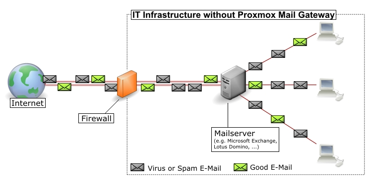
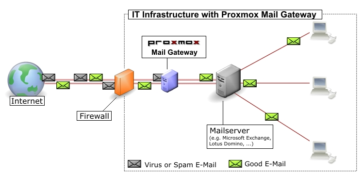

Planning for Deployment
=======================

Easy integration into existing e-mail server architecture
---------------------------------------------------------

In this sample configuration, your e-mail traffic (SMTP) arrives on
the firewall and will be directly forwarded to your e-mail server.

By using the {pmg}, all your e-mail traffic is forwarded to the
Proxmox Mail Gateway, which filters the whole e-mail traffic and
removes unwanted e-mails. You can manage incoming and outgoing mail
traffic.

Filtering outgoing e-mails
--------------------------

Many e-mail filter solutions do not scan outgoing mails. Opposed to
that {pmg} is designed to scan both incoming and outgoing
e-mails. This has two major advantages:

. {pmg} is able to detect viruses sent from an internal host. In many
countries you are liable for not sending viruses to other
people. {pmg} outgoing e-mail scanning feature is an additional
protection to avoid that.

. {pmg} can gather statistics about outgoing e-mails too. Statistics
about incoming e-mails looks nice, but they are quite
useless. Consider two users, user-1 receives 10 e-mails from news
portals and wrote 1 e-mail to a person you never heard from. While
user-2 receives 5 e-mails from a customer and sent 5 e-mails
back. Which user do you consider more active? I am sure its user-2,
because he communicates with your customers. {pmg} advanced address
statistics can show you this important information. Solution which
does not scan outgoing e-mail cannot do that.

To enable outgoing e-mail filtering you just need to send all outgoing
e-mails through your {png} (usually by specifying Proxmox as
"smarthost" on your e-mail server - see
xref:mail_server_config[Example mail server configuration].

[[firewall_settings]]
Firewall settings
-----------------

In order to pass e-mail traffic to the {pmg} you need to allow traffic
on the SMTP the port. Our servers use the Network Time Protocol (NTP)
for time synchronization, RAZOR, DNS, SSH, HTTP and port 8006 for the web
based management interface.

[options="header"]
|======
|Service |Port    |Protocol |From       |To
|SMTP    |25      |TCP      |Proxmox    |Internet
|SMTP    |25      |TCP      |Internet   |Proxmox
|SMTP    |26      |TCP      |Mailserver |Proxmox
|NTP     |123     |TCP/UDP  |Proxmox    |Internet
|RAZOR   |2703    |TCP      |Proxmox    |Internet
|DNS     |53      |TCP/UDP  |Proxmox    |DNS Server
|HTTP    |80      |TCP      |Proxmox    |Internet
|GUI/API |8006    |TCP      |Intranet   |Proxmox
|======

CAUTION: It is advisable to restrict access to the GUI/API port as far
as possible.

The outgoing HTTP connection is mainly used by virus pattern updates,
and can be configured to use a proxy instead of a direct internet
connection.

You can use the 'nmap' utility to test your firewall settings (see
section xref:nmap[port scans]).

[[system_requirements]]
System Requirements
-------------------

{pmg} needs dedicated server hardware but can also run inside a
virtual machine on any of the following plattforms:

* Proxmox VE (KVM)

* VMWare vSphere&trade; (open-vm tools are integrated in the ISO)

* Hyper-V&trade; (Hyper-V Linux integration tools are integrated in the ISO)

* KVM (virtio drivers are integrated, great performance)

* Virtual box&trade;

* Citrix XenServer&trade;

Please see http://www.proxmox.com for details.

In order to get a benchmark from your hardware, just run 'pmgperf'
after installation.

Minimum System Requirements
~~~~~~~~~~~~~~~~~~~~~~~~~~~

* CPU: 64bit (Intel EMT64 or AMD64)

* 1 GB RAM

* bootable CD-ROM-drive or USB boot support

* 1024x768 capable VGA/Monitor for Installer

* Hard disk 8 GB - ATA/SATA/SCSI/NVME

* Ethernet Network interface card

Recommended System Requirements
~~~~~~~~~~~~~~~~~~~~~~~~~~~~~~~

* Multicore CPU: 64bit (Intel EMT64 or AMD64)

* 4 GB RAM

* bootable CD-ROM-drive or USB boot support

* 1024x768 capable VGA/Monitor for Installer

* 1 GBps Ethernet Network interface card

* Hardware RAID1 or RAID10, Raid Controllers need write cache with
  batteries backup module for best performance

* Enterprise class SSD with power loss protection (e.g. Intel SSD DC
  35xx/36xx/37xx)
