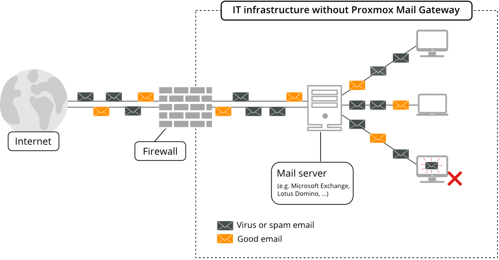
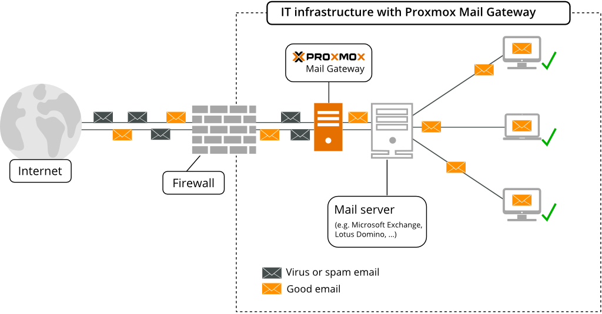

[[chapter_deployment]]
Planning for Deployment
=======================

Easy integration into existing e-mail server architecture
---------------------------------------------------------

In this sample configuration, your e-mail traffic (SMTP) arrives on
the firewall and will be directly forwarded to your e-mail server.

By using the {pmg}, all your e-mail traffic is forwarded to the
Proxmox Mail Gateway, which filters the e-mail traffic and
removes unwanted e-mails. You can manage incoming and outgoing mail
traffic.

Filtering outgoing e-mails
--------------------------

Many e-mail filtering solutions do not scan outgoing mails. In contrast, {pmg} is
designed to scan both incoming and outgoing e-mails. This has two major
advantages:

. {pmg} is able to detect viruses sent from an internal host. In many
countries you are liable for sending viruses to other
people. The outgoing e-mail scanning feature is an additional
protection to avoid that.

. {pmg} can gather statistics about outgoing e-mails too. Statistics
about incoming e-mails looks nice, but they are quite
useless. Consider two users, user-1 receives 10 e-mails from news
portals and wrote 1 e-mail to a person you never heard from. While
user-2 receives 5 e-mails from a customer and sent 5 e-mails
back. Which user do you consider more active? I am sure it's user-2,
because he communicates with your customers. {pmg} advanced address
statistics can show you this important information. A solution which
does not scan outgoing e-mail cannot do that.

To enable outgoing e-mail filtering you just need to send all outgoing
e-mails through your {pmg} (usually by specifying Proxmox as
"smarthost" on your e-mail server).

[[firewall_settings]]
Firewall settings
-----------------

In order to pass e-mail traffic to the {pmg} you need to allow traffic on the
SMTP port. Our software uses the Network Time Protocol (NTP) for time
synchronization, RAZOR, DNS, SSH, HTTP and port 8006 for the web-based
management interface.

[options="header"]
|======
|Service |Port    |Protocol |From       |To
|SMTP    |25      |TCP      |Proxmox    |Internet
|SMTP    |25      |TCP      |Internet   |Proxmox
|SMTP    |26      |TCP      |Mailserver |Proxmox
|NTP     |123     |TCP/UDP  |Proxmox    |Internet
|RAZOR   |2703    |TCP      |Proxmox    |Internet
|DNS     |53      |TCP/UDP  |Proxmox    |DNS Server
|HTTP    |80      |TCP      |Proxmox    |Internet
|GUI/API |8006    |TCP      |Intranet   |Proxmox
|======

CAUTION: It is recommended to restrict access to the GUI/API port as far
as possible.

The outgoing HTTP connection is mainly used by virus pattern updates,
and can be configured to use a proxy instead of a direct internet
connection.

You can use the 'nmap' utility to test your firewall settings (see
section xref:nmap[port scans]).

[[system_requirements]]
System Requirements
-------------------

The {pmg} can run on dedicated server hardware or inside a virtual machine on
any of the following platforms:

* Proxmox VE (KVM)

* VMWare vSphere&trade; (open-vm tools are integrated in the ISO)

* Hyper-V&trade; (Hyper-V Linux integration tools are integrated in the ISO)

* KVM (virtio drivers are integrated, great performance)

* VirtualBox&trade;

* Citrix Hypervisor&trade; (former XenServer&trade;)

* LXC container

* and others supporting Debian Linux as guest OS

Please see https://www.proxmox.com for details.

In order to get a benchmark from your hardware, just run 'pmgperf'
after installation.

Minimum System Requirements
~~~~~~~~~~~~~~~~~~~~~~~~~~~

* CPU: 64bit (Intel EMT64 or AMD64)

* 2 GB RAM

* bootable CD-ROM-drive or USB boot support

* Monitor with a resolution of 1024x768 for the installation

* Hard disk with at least 8 GB of disk space

* Ethernet network interface card

Recommended System Requirements
~~~~~~~~~~~~~~~~~~~~~~~~~~~~~~~

* Multicore CPU: 64bit (Intel EMT64 or AMD64), +
  for use as virtual machine activate Intel VT/AMD-V CPU flag

* 4 GB RAM

* bootable CD-ROM-drive or USB boot support

* Monitor with a resolution of 1024x768 for the installation

* 1 Gbps Ethernet network interface card

* Storage: at least 8 GB free disk space, best setup with redundancy,
  use hardware RAID controller with battery backed write cache (``BBU'') or
  ZFS. ZFS is not compatible with a hardware RAID controller. For best
  performance use Enterprise class SSD with power loss protection.

Supported web browsers for accessing the web interface
~~~~~~~~~~~~~~~~~~~~~~~~~~~~~~~~~~~~~~~~~~~~~~~~~~~~~~

To use the web interface you need a modern browser, this includes:

* Firefox, a release from the current year, or the latest Extended
Support Release
* Chrome, a release from the current year
* Microsoft's currently supported version of Edge
* Safari, a release from the current year
