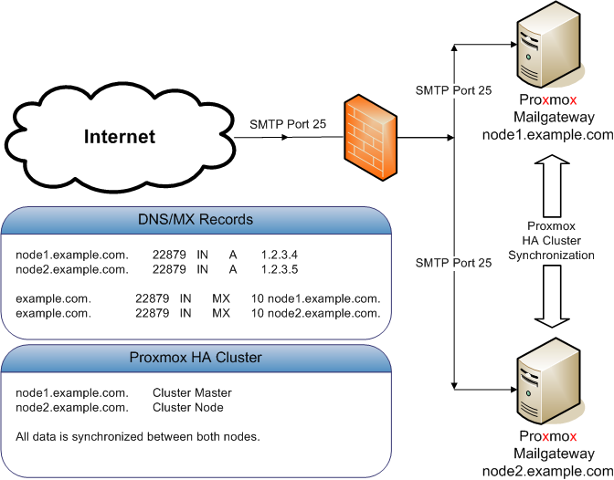

[[chapter_pmgcm]]
ifdef::manvolnum[]
pmgcm(1)
========
:pmg-toplevel:

NAME
----

pmgcm - Proxmox Mail Gateway Cluster Management Toolkit

SYNOPSIS
--------

include::pmgcm.1-synopsis.adoc[]

DESCRIPTION
-----------
endif::manvolnum[]
ifndef::manvolnum[]
Cluster Management
==================
:pmg-toplevel:
endif::manvolnum[]

We are living in a world where email becomes more and more important -
failures in email systems are just not acceptable. To meet these
requirements we developed the Proxmox HA (High Availability) Cluster.

The {pmg} HA Cluster consists of a master and several slave nodes
(minimum one node). Configuration is done on the master. Configuration
and data is synchronized to all cluster nodes over a VPN tunnel. This
provides the following advantages:

* centralized configuration management

* fully redundant data storage

* high availability

* high performance

We use a unique application level clustering scheme, which provides
extremely good performance. Special considerations where taken to make
management as easy as possible. Complete Cluster setup is done within
minutes, and nodes automatically reintegrate after temporary failures
without any operator interaction.

Hardware requirements
---------------------

There are no special hardware requirements, although it is highly
recommended to use fast and reliable server with redundant disks on
all cluster nodes (Hardware RAID with BBU and write cache enabled).

The HA Cluster can also run in virtualized environments.

Subscriptions
-------------

Each host in a cluster has its own subscription. If you want support
for a cluster, each cluster node needs to have a valid
subscription. All nodes must have the same subscription level.

Load balancing
--------------

You can use one of the mechanism described in chapter 9 if you want to
distribute mail traffic among the cluster nodes. Please note that this
is not always required, because it is also reasonable to use only one
node to handle SMTP traffic. The second node is used as quarantine
host (provide the web interface to user quarantine).

Cluster administration
----------------------

Cluster administration is done with a single command line utility
called `pmgcm'. So you need to login via ssh to manage the cluster
setup.

NOTE: Always setup the IP configuration before adding a node to the
cluster. IP address, network mask, gateway address and hostname can’t
be changed later.

Creating a Cluster
~~~~~~~~~~~~~~~~~~

You can create a cluster from any existing Proxmox host. All data is
preserved.

* make sure you have the right IP configuration
  (IP/MASK/GATEWAY/HOSTNAME), because you cannot changed that later

* run the cluster creation command:
+
----
pmgcm create
----

List Cluster Status
~~~~~~~~~~~~~~~~~~~

----
pmgcm status
--NAME(CID)--------------IPADDRESS----ROLE-STATE---------UPTIME---LOAD----MEM---DISK
pmg5(1)              192.168.2.127   master A       1 day 21:18   0.30    80%    41%
----

Adding Cluster Nodes
~~~~~~~~~~~~~~~~~~~~

When you add a new node to a cluster (join) all data on that node is
destroyed. The whole database is initialized with cluster data from
the master.

* make sure you have the right IP configuration

* run the cluster join command (on the new node):
+
----
pmgcm join <master_ip>
----

You need to enter the root password of the master host when asked for
a password.

CAUTION: Node initialization deletes all existing databases, stops and
then restarts all services accessing the database. So do not add nodes
which are already active and receive mails.

Also, joining a cluster can take several minutes, because the new node
needs to synchronize all data from the master (although this is done
in the background).

NOTE: If you join a new node, existing quarantined items from the other nodes are not synchronized to the new node.

Deleting Nodes
~~~~~~~~~~~~~~

Please detach nodes from the cluster network before removing them
from the cluster configuration. Then run the following command on
the master node:

----
pmgcm delete <cid>
----

Parameter `<cid>` is the unique cluster node ID, as listed with `pmgcm status`.

Disaster Recovery
~~~~~~~~~~~~~~~~~

It is highly recommended to use redundant disks on all cluster nodes
(RAID). So in almost any circumstances you just need to replace the
damaged hardware or disk. {pmg} uses an asynchronous
clustering algorithm, so you just need to reboot the repaired node,
and everything will work again transparently.

The following scenarios only apply when you really loose the contents
of the hard disk.

Single Node Failure
^^^^^^^^^^^^^^^^^^^

* delete failed node on master
+
----
pmgcm delete <cid>
----

* add (re-join) a new node
+
----
pmgcm join <master_ip>
----

Master Failure
^^^^^^^^^^^^^^

* force another node to be master
+
-----
pmgcm promote
-----

* tell other nodes that master has changed
+
----
pmgcm sync --master_ip <master_ip>
----

Total Cluster Failure
^^^^^^^^^^^^^^^^^^^^^

* restore backup (Cluster and node information is not restored, you
  have to recreate master and nodes)

* tell it to become master
+
----
pmgcm create
----

* install new nodes

* add those new nodes to the cluster
+
----
pmgcm join <master_ip>
----

ifdef::manvolnum[]
include::pmg-copyright.adoc[]
endif::manvolnum[]
