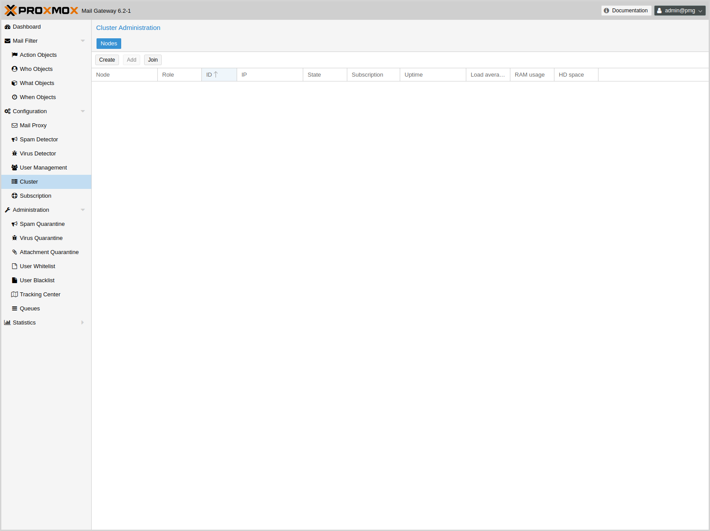
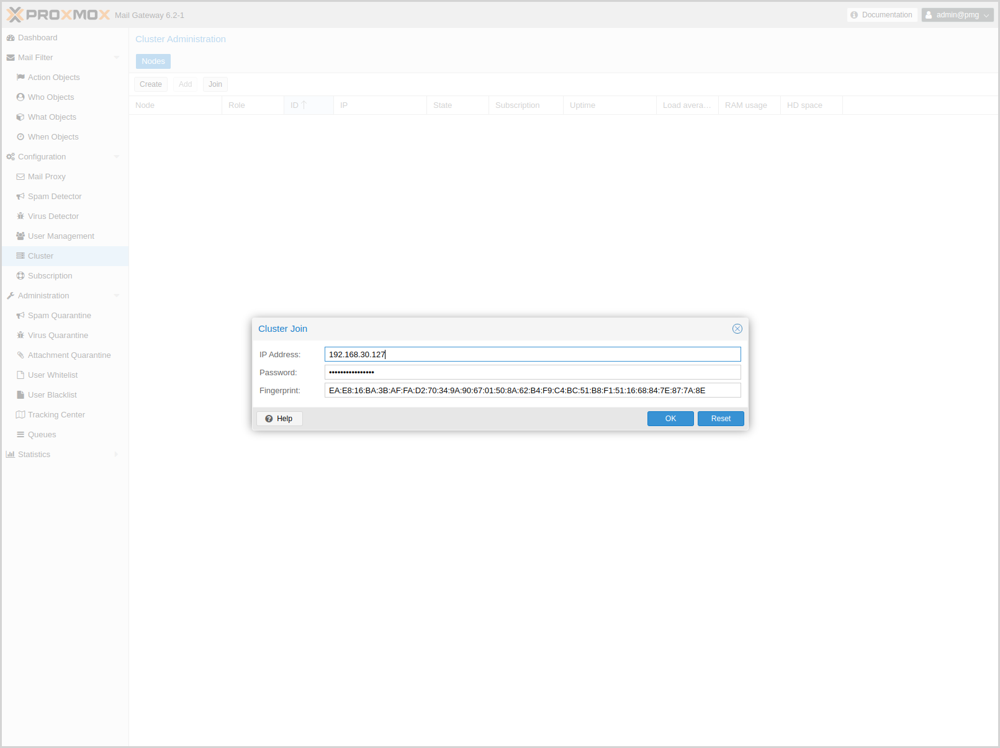

[[chapter_pmgcm]]
ifdef::manvolnum[]
pmgcm(1)
========
:pmg-toplevel:

NAME
----

pmgcm - Proxmox Mail Gateway Cluster Management Toolkit

SYNOPSIS
--------

include::pmgcm.1-synopsis.adoc[]

DESCRIPTION
-----------
endif::manvolnum[]
ifndef::manvolnum[]
Cluster Management
==================
:pmg-toplevel:
endif::manvolnum[]

We are living in a world where email becomes more and more important -
failures in email systems are just not acceptable. To meet these
requirements we developed the Proxmox HA (High Availability) Cluster.

The {pmg} HA Cluster consists of a master and several slave nodes
(minimum one node). Configuration is done on the master. Configuration
and data is synchronized to all cluster nodes over a VPN tunnel. This
provides the following advantages:

* centralized configuration management

* fully redundant data storage

* high availability

* high performance

We use a unique application level clustering scheme, which provides
extremely good performance. Special considerations where taken to make
management as easy as possible. Complete Cluster setup is done within
minutes, and nodes automatically reintegrate after temporary failures
without any operator interaction.

image::images/Proxmox_HA_cluster_final_1024.png[]

Hardware requirements
---------------------

There are no special hardware requirements, although it is highly
recommended to use fast and reliable server with redundant disks on
all cluster nodes (Hardware RAID with BBU and write cache enabled).

The HA Cluster can also run in virtualized environments.

Subscriptions
-------------

Each host in a cluster has its own subscription. If you want support
for a cluster, each cluster node needs to have a valid
subscription. All nodes must have the same subscription level.

Load balancing
--------------

It is usually advisable to distribute mail traffic among all cluster
nodes. Please note that this is not always required, because it is
also reasonable to use only one node to handle SMTP traffic. The
second node is used as quarantine host, and only provides the web
interface to the user quarantine.

The normal mail delivery process looks up DNS Mail Exchange (`MX`)
records to determine the destination host. A `MX` record tells the
sending system where to deliver mail for a certain domain. It is also
possible to have several `MX` records for a single domain, they can have
different priorities. For example, our `MX` record looks like that:

----
# dig -t mx proxmox.com

;; ANSWER SECTION:
proxmox.com.            22879   IN      MX      10 mail.proxmox.com.

;; ADDITIONAL SECTION:
mail.proxmox.com.       22879   IN      A       213.129.239.114
----

Please notice that there is one single `MX` record for the Domain
`proxmox.com`, pointing to `mail.proxmox.com`. The `dig` command
automatically puts out the corresponding address record if it
exists. In our case it points to `213.129.239.114`. The priority of
our `MX` record is set to 10 (preferred default value).

Hot standby with backup `MX` records
~~~~~~~~~~~~~~~~~~~~~~~~~~~~~~~~~~~~

Many people do not want to install two redundant mail proxies, instead
they use the mail proxy of their ISP as fall-back. This is simply done
by adding an additional `MX` Record with a lower priority (higher
number). With the example above this looks like that:

----
proxmox.com.            22879   IN      MX      100 mail.provider.tld.
----

Sure, your provider must accept mails for your domain and forward
received mails to you. Please note that such setup is not really
advisable, because spam detection needs to be done by that backup `MX`
server also, and external servers provided by ISPs usually don't do
that.

You will never lose mails with such a setup, because the sending Mail
Transport Agent (MTA) will simply deliver the mail to the backup
server (mail.provider.tld) if the primary server (mail.proxmox.com) is
not available.

NOTE: Any resononable mail server retries mail devivery if the target
server is not available, i.e. {pmg} stores mail and retries delivery
for up to one week. So you will not loose mail if you mail server is
down, even if you run a single server setup.

Load balancing with `MX` records
~~~~~~~~~~~~~~~~~~~~~~~~~~~~~~~~

Using your ISPs mail server is not always a good idea, because many
ISPs do not use advanced spam prevention techniques, or do not filter
SPAM at all. It is often better to run a second server yourself to
avoid lower spam detection rates.

Anyways, it’s quite simple to set up a high performance load balanced
mail cluster using `MX` records. You just need to define two `MX` records
with the same priority. I will explain this using a complete example
to make it clearer.

First, you need to have at least 2 working {pmg} servers
(mail1.example.com and mail2.example.com) configured as cluster (see
section xref:pmg_cluster_administration[Cluster administration]
below), each having its own IP address. Let us assume the following
addresses (DNS address records):

----
mail1.example.com.       22879   IN      A       1.2.3.4
mail2.example.com.       22879   IN      A       1.2.3.5
----

Btw, it is always a good idea to add reverse lookup entries (PTR
records) for those hosts. Many email systems nowadays reject mails
from hosts without valid PTR records.  Then you need to define your `MX`
records:

----
example.com.            22879   IN      MX      10 mail1.example.com.
example.com.            22879   IN      MX      10 mail2.example.com.
----

This is all you need. You will receive mails on both hosts, more or
less load-balanced using round-robin scheduling. If one host fails the
other is used.

Other ways
~~~~~~~~~~

Multiple address records
^^^^^^^^^^^^^^^^^^^^^^^^

Using several DNS `MX` record is sometime clumsy if you have many
domains. It is also possible to use one `MX` record per domain, but
multiple address records:

----
example.com.            22879   IN      MX      10 mail.example.com.
mail.example.com.       22879   IN      A       1.2.3.4
mail.example.com.       22879   IN      A       1.2.3.5
----

Using firewall features
^^^^^^^^^^^^^^^^^^^^^^^

Many firewalls can do some kind of RR-Scheduling (round-robin) when
using DNAT. See your firewall manual for more details.

[[pmg_cluster_administration]]
Cluster administration
----------------------

Cluster administration can be done on the GUI or using the command
line utility `pmgcm`. The CLI tool is a bit more verbose, so we suggest
to use that if you run into problems.

NOTE: Always setup the IP configuration before adding a node to the
cluster. IP address, network mask, gateway address and hostname can’t
be changed later.

Creating a Cluster
~~~~~~~~~~~~~~~~~~

You can create a cluster from any existing Proxmox host. All data is
preserved.

* make sure you have the right IP configuration
  (IP/MASK/GATEWAY/HOSTNAME), because you cannot change that later

* press the create button on the GUI, or run the cluster creation command:
+
----
pmgcm create
----

NOTE: The node where you run the cluster create command will be the
'master' node.

Show Cluster Status
~~~~~~~~~~~~~~~~~~~

The GUI shows the status of all cluster nodes, and it is also possible
to use the command line tool:

----
pmgcm status
--NAME(CID)--------------IPADDRESS----ROLE-STATE---------UPTIME---LOAD----MEM---DISK
pmg5(1)              192.168.2.127   master A       1 day 21:18   0.30    80%    41%
----

[[pmgcm_join]]
Adding Cluster Nodes
~~~~~~~~~~~~~~~~~~~~

When you add a new node to a cluster (join) all data on that node is
destroyed. The whole database is initialized with cluster data from
the master.

* make sure you have the right IP configuration

* run the cluster join command (on the new node):
+
----
pmgcm join <master_ip>
----

You need to enter the root password of the master host when asked for
a password. When joining a cluster using the GUI, you also need to
enter the 'fingerprint' of the master node. You get that information
by pressing the `Add` button on the master node.

CAUTION: Node initialization deletes all existing databases, stops and
then restarts all services accessing the database. So do not add nodes
which are already active and receive mails.

Also, joining a cluster can take several minutes, because the new node
needs to synchronize all data from the master (although this is done
in the background).

NOTE: If you join a new node, existing quarantined items from the other nodes are not synchronized to the new node.

Deleting Nodes
~~~~~~~~~~~~~~

Please detach nodes from the cluster network before removing them
from the cluster configuration. Then run the following command on
the master node:

----
pmgcm delete <cid>
----

Parameter `<cid>` is the unique cluster node ID, as listed with `pmgcm status`.

Disaster Recovery
~~~~~~~~~~~~~~~~~

It is highly recommended to use redundant disks on all cluster nodes
(RAID). So in almost any circumstances you just need to replace the
damaged hardware or disk. {pmg} uses an asynchronous
clustering algorithm, so you just need to reboot the repaired node,
and everything will work again transparently.

The following scenarios only apply when you really loose the contents
of the hard disk.

Single Node Failure
^^^^^^^^^^^^^^^^^^^

* delete failed node on master
+
----
pmgcm delete <cid>
----

* add (re-join) a new node
+
----
pmgcm join <master_ip>
----

Master Failure
^^^^^^^^^^^^^^

* force another node to be master
+
-----
pmgcm promote
-----

* tell other nodes that master has changed
+
----
pmgcm sync --master_ip <master_ip>
----

Total Cluster Failure
^^^^^^^^^^^^^^^^^^^^^

* restore backup (Cluster and node information is not restored, you
  have to recreate master and nodes)

* tell it to become master
+
----
pmgcm create
----

* install new nodes

* add those new nodes to the cluster
+
----
pmgcm join <master_ip>
----

ifdef::manvolnum[]
include::pmg-copyright.adoc[]
endif::manvolnum[]
