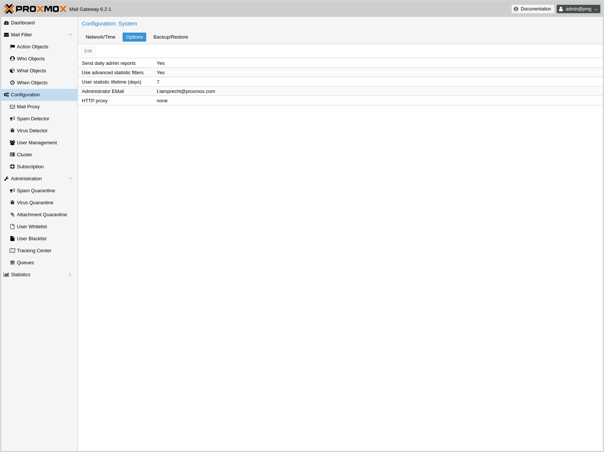
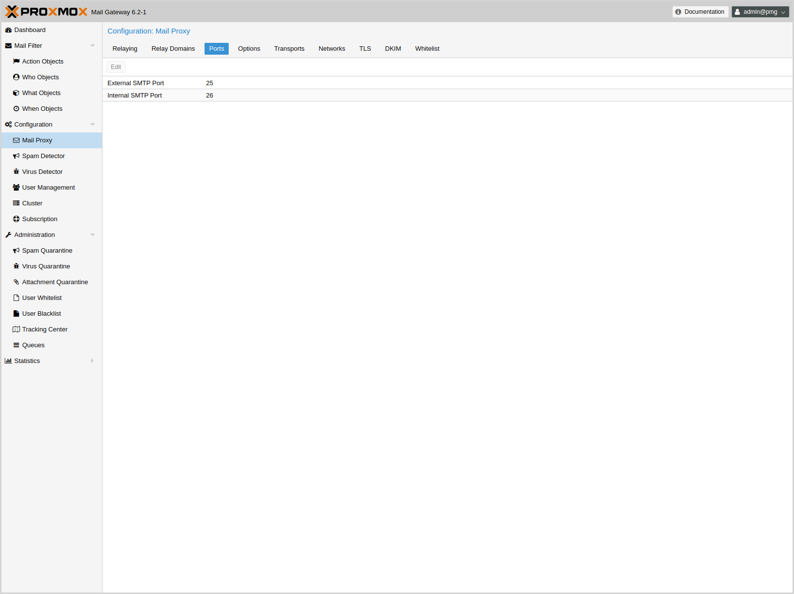
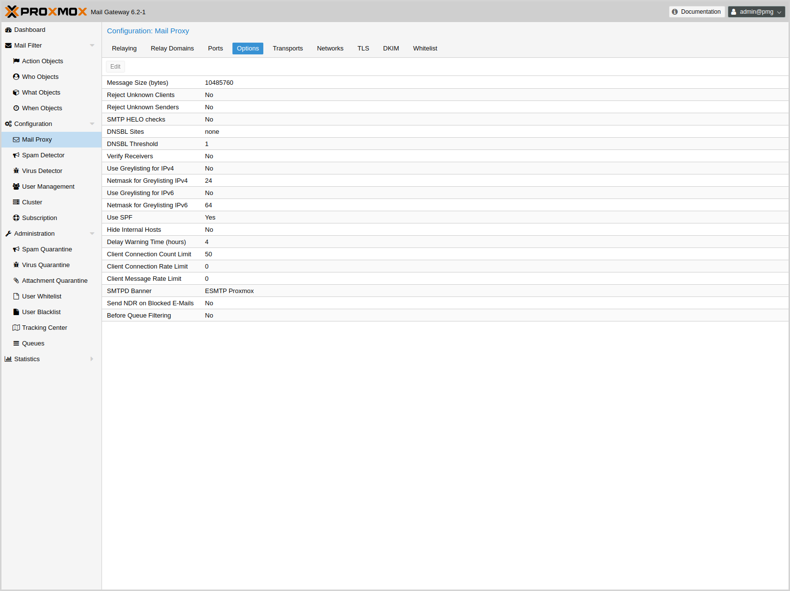

[[chapter_pmgconfig]]
ifdef::manvolnum[]
pmgconfig(1)
============
:pmg-toplevel:

NAME
----

pmgconfig - Proxmox Mail Gateway Configuration Management Toolkit

SYNOPSIS
--------

include::pmgconfig.1-synopsis.adoc[]

DESCRIPTION
-----------
endif::manvolnum[]
ifndef::manvolnum[]
Configuration Management
========================
:pmg-toplevel:
endif::manvolnum[]

{pmg} is usually configured using the web-based Graphical User
Interface (GUI), but it is also possible to directly edit the
configuration files, use the REST API over 'https'
or the command line tool `pmgsh`.

The command line tool `pmgconfig` is used to simplify some common
configuration tasks, i.e. to generate cerificates and to rewrite
service configuration files.

NOTE: We use a Postgres database to store mail filter rules and
statistic data. See chapter xref:chapter_pmgdb[Database Management]
for more information.

Configuration files overview
----------------------------

`/etc/network/interfaces`::

Network setup. We never modify this files directly. Instead, we write
changes to `/etc/network/interfaces.new`. When you reboot, we rename
the file to `/etc/network/interfaces`, so any changes gets activated
on the next reboot.

`/etc/resolv.conf`::

DNS search domain and nameserver setup.

`/etc/hostname`::

The system's host name.

`/etc/hosts`::

Static table lookup for hostnames.

`/etc/pmg/pmg.conf`::

Stores common administration options, i.e. the spam and mail proxy setup.

`/etc/pmg/cluster.conf`::

The cluster setup.

`/etc/pmg/domains`::

The list of relay domains.

`/etc/pmg/fetchmailrc`::

Fetchmail configuration (POP3 and IMAP setup).

`/etc/pmg/ldap.conf`::

LDAP configuration.

`/etc/pmg/mynetworks`::

List of local (trusted) networks.

`/etc/pmg/subscription`::

Stores your subscription key and status.

`/etc/pmg/transports`::

Message delivery transport setup.

`/etc/pmg/user.conf`::

GUI user configuration.

`/etc/mail/spamassassin/custom.cf`::

Custom {spamassassin} setup.

Keys and Certificates
---------------------

`/etc/pmg/pmg-api.pem`::

Key and certificate (combined) used be the HTTPs server (API).

`/etc/pmg/pmg-authkey.key`::

Privat key use to generate authentication tickets.

`/etc/pmg/pmg-authkey.pub`::

Public key use to verify authentication tickets.

`/etc/pmg/pmg-csrf.key`::

Internally used to generate CSRF tokens.

`/etc/pmg/pmg-tls.pem`::

Key and certificate (combined) to encrypt mail traffic (TLS).

Service Configuration Templates
-------------------------------

{pmg} uses various services to implement mail filtering, for example
the {postfix} Mail Transport Agent (MTA), the {clamav} antivirus
engine and the Apache {spamassassin} project. Those services use
separate configuration files, so we need to rewrite those files when
configuration is changed.

We use a template based approach to generate those files. The {tts} is
a well known, fast and flexible template processing system. You can
find the default templates in `/var/lib/pmg/templates/`. Please do not
modify them directly, because your modification would get lost on the
next update. Instead, copy them to `/etc/pmg/templates/`, then apply
your changes there.

Templates can access any configuration setting, and you can use the
`pmgconfig dump` command to get a list of all variable names:

----
# pmgconfig dump
...
dns.domain = yourdomain.tld
dns.hostname = pmg
ipconfig.int_ip = 192.168.2.127
pmg.admin.advfilter = 1
...
----

The same tool is used to force regeneration of all template based
configuration files. You need to run that after modifying a template,
or when you directly edit configuration files

----
# pmgconfig sync --restart 1
----

Above commands also restarts services if underlying configuration
files are changed. Please note that this is automatically done when
you change the configuration using the GUI or API.

NOTE: Modified templates from `/etc/pmg/templates/` are automatically
synced from the master node to all cluster members.

System Configuration
--------------------

Network and Time
~~~~~~~~~~~~~~~~

ifndef::manvolnum[]
image::images/screenshot/pmg-gui-network-config.png[]
endif::manvolnum[]

Normally the network and time is already configured when you visit the
GUI. The installer asks for those setting and sets up the correct
values.

The default setup uses a single Ethernet adapter and static IP
assignment. The configuration is stored at '/etc/network/interfaces',
and the actual network setup is done the standard Debian way using
package 'ifupdown'.

.Example network setup '/etc/network/interfaces'
----
source /etc/network/interfaces.d/*

auto lo
iface lo inet loopback

auto ens18
iface ens18 inet static
	address  192.168.2.127
	netmask  255.255.240.0
	gateway  192.168.2.1
----

.DNS recommendations

Many tests to detect SPAM mails use DNS queries, so it is important to
have a fast and reliable DNS server. We also query some public
available DNS Blacklists. Most of them apply rate limits for clients,
so they simply will not work if you use a public DNS server (because
they are usually blocked). We recommend to use your own DNS server,
which need to be configured in 'recursive' mode.

Options
~~~~~~~

ifndef::manvolnum[]

endif::manvolnum[]

Those settings are saved to subsection 'admin' in `/etc/pmg/pmg.conf`,
using the following configuration keys:

include::pmg.admin-conf-opts.adoc[]

Mail Proxy Configuration
------------------------

Relaying
~~~~~~~~

ifndef::manvolnum[]
image::images/screenshot/pmg-gui-mailproxy-relaying.png[]
endif::manvolnum[]

Those settings are saved to subsection 'mail' in `/etc/pmg/pmg.conf`,
using the following configuration keys:

include::pmg.mail-relaying-conf-opts.adoc[]

Relay Domains
~~~~~~~~~~~~~

ifndef::manvolnum[]
image::images/screenshot/pmg-gui-mailproxy-relaydomains.png[]
endif::manvolnum[]

TODO

Ports
~~~~~

ifndef::manvolnum[]

endif::manvolnum[]

Those settings are saved to subsection 'mail' in `/etc/pmg/pmg.conf`,
using the following configuration keys:

include::pmg.mail-ports-conf-opts.adoc[]

Options
~~~~~~~

ifndef::manvolnum[]

endif::manvolnum[]

Those settings are saved to subsection 'mail' in `/etc/pmg/pmg.conf`,
using the following configuration keys:

include::pmg.mail-options-conf-opts.adoc[]

Transports
~~~~~~~~~~

ifndef::manvolnum[]
image::images/screenshot/pmg-gui-mailproxy-transports.png[]
endif::manvolnum[]

You can use {pmg} to send e-mails to different internal
e-mail servers. For example you can send e-mails addressed to
domain.com to your first e-mail server, and e-mails addressed to
subdomain.domain.com to a second one.

You can add the IP addresses, hostname and SMTP ports and mail domains (or
just single email addresses) of your additional e-mail servers.

Networks
~~~~~~~~

ifndef::manvolnum[]
image::images/screenshot/pmg-gui-mailproxy-networks.png[]
endif::manvolnum[]

You can add additional internal (trusted) IP networks or hosts.
All hosts in this list are allowed to relay.

NOTE: Hosts in the same subnet with Proxmox can relay by default and
it’s not needed to add them in this list.

TLS
~~~

ifndef::manvolnum[]
image::images/screenshot/pmg-gui-mailproxy-tls.png[]
endif::manvolnum[]

Transport Layer Security (TLS) provides certificate-based
authentication and encrypted sessions. An encrypted session protects
the information that is transmitted with SMTP mail. When you activate
TLS, {pmg} automatically generates a new self signed
certificate for you (`/etc/pmg/pmg-tls.pem`).

{pmg} uses opportunistic TLS encryption. The SMTP transaction is
encrypted if the 'STARTTLS' ESMTP feature is supported by the remote
server. Otherwise, messages are sent in the clear.

Enable TLS logging::

To get additional information about SMTP TLS activity you can enable
TLS logging. That way information about TLS sessions and used
certificate’s is logged via syslog.

Add TLS received header::

Set this option to include information about the protocol and cipher
used as well as the client and issuer CommonName into the "Received:"
message header.

Those settings are saved to subsection 'mail' in `/etc/pmg/pmg.conf`,
using the following configuration keys:

include::pmg.mail-tls-conf-opts.adoc[]

Whitelist
~~~~~~~~~

ifndef::manvolnum[]
image::images/screenshot/pmg-gui-mailproxy-whitelist.png[]
endif::manvolnum[]

TODO

Spam Detector Configuration
---------------------------

TODO

Virus Detector Configuration
----------------------------

TODO

User Management
---------------

TODO

ifdef::manvolnum[]
include::pmg-copyright.adoc[]
endif::manvolnum[]

