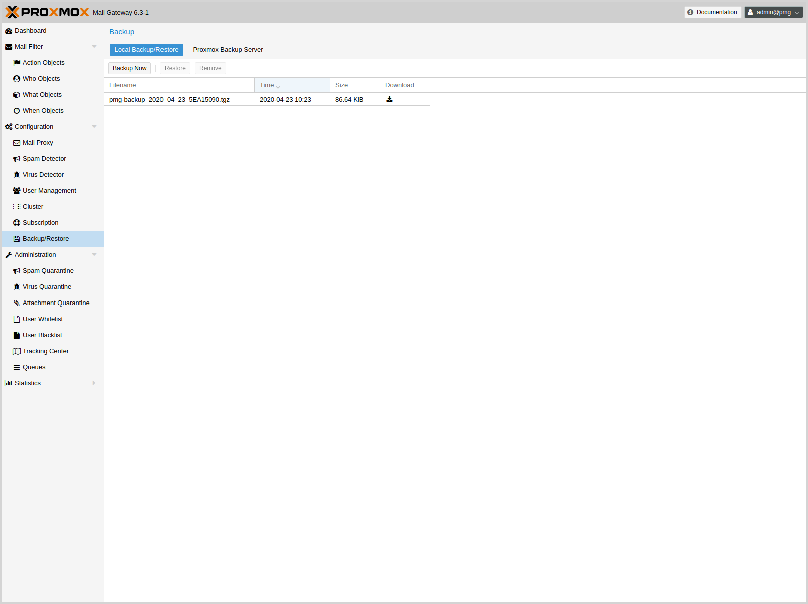

[[chapter_pmgconfig]]
ifdef::manvolnum[]
pmgconfig(1)
============
:pmg-toplevel:

NAME
----

pmgconfig - Proxmox Mail Gateway Configuration Management Toolkit

SYNOPSIS
--------

include::pmgconfig.1-synopsis.adoc[]

DESCRIPTION
-----------
endif::manvolnum[]
ifndef::manvolnum[]
Configuration Management Toolkit
================================
:pmg-toplevel:
endif::manvolnum[]

{pmg} is usually configured using the web-based Graphical User
Interface (GUI), but it is also possible to directly edit the
configuration files, use the REST API over 'https'
or the command line tool 'pmgsh'.

The command line tool 'pmgconfig' is used to simplify some common
configuration tasks, i.e. to generate cerificates and to rewrite
service configuration files.

System Configuration
--------------------

Network and Time
~~~~~~~~~~~~~~~~

ifndef::manvolnum[]
image::images/screenshot/pmg-gui-network-config.png[]
endif::manvolnum[]

TODO

Options
~~~~~~~

ifndef::manvolnum[]
image::images/screenshot/pmg-gui-system-options.png[]
endif::manvolnum[]

include::pmg.admin-conf-opts.adoc[]

Backup and Restore
~~~~~~~~~~~~~~~~~~

ifndef::manvolnum[]

endif::manvolnum[]

TODO

ifdef::manvolnum[]
include::pmg-copyright.adoc[]
endif::manvolnum[]

