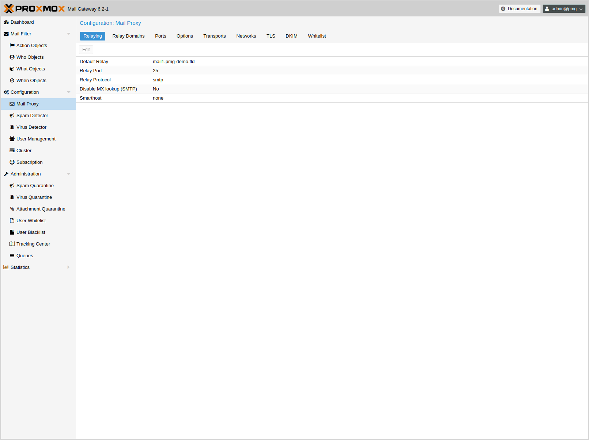
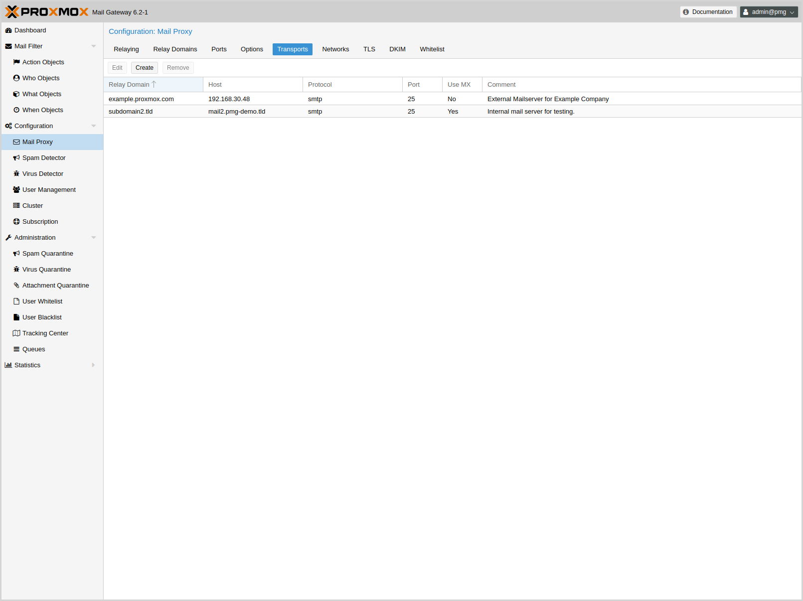
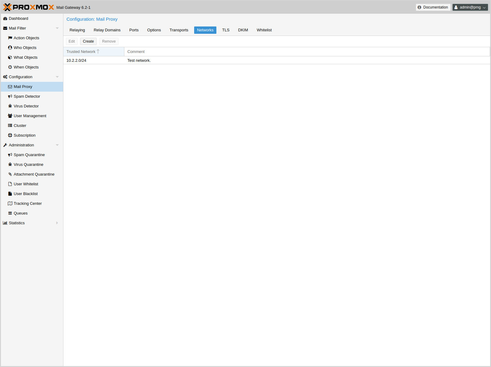
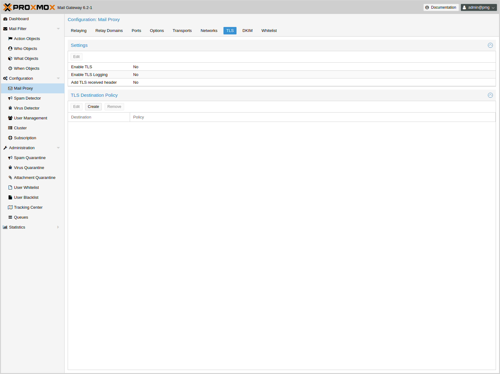
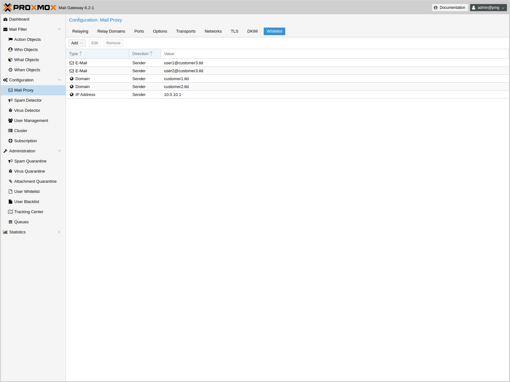
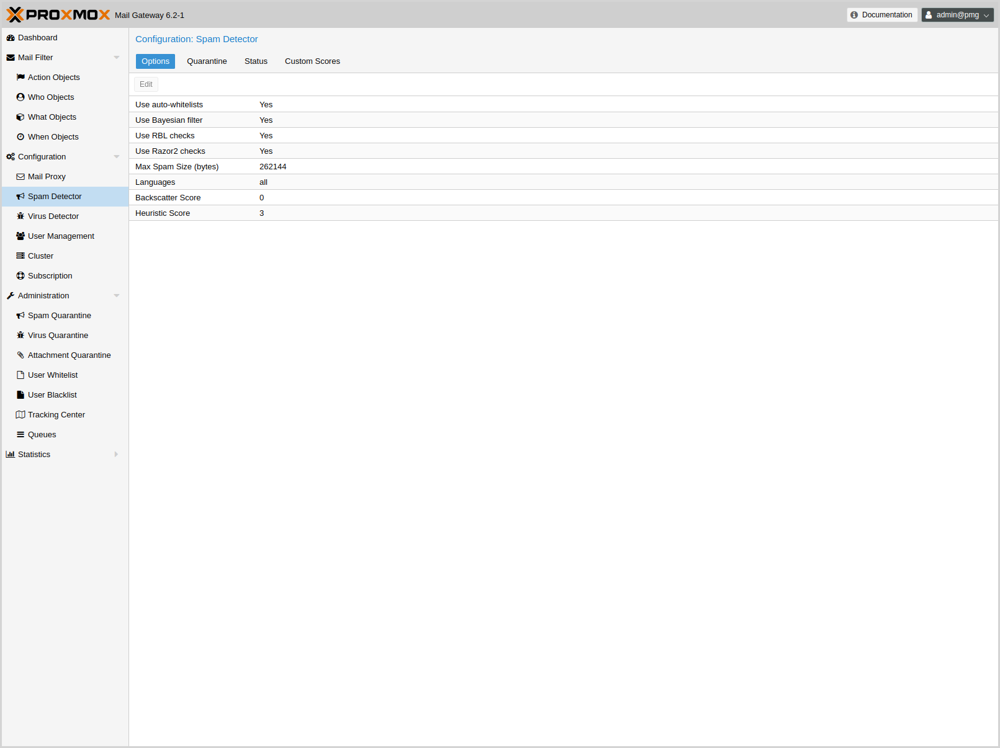
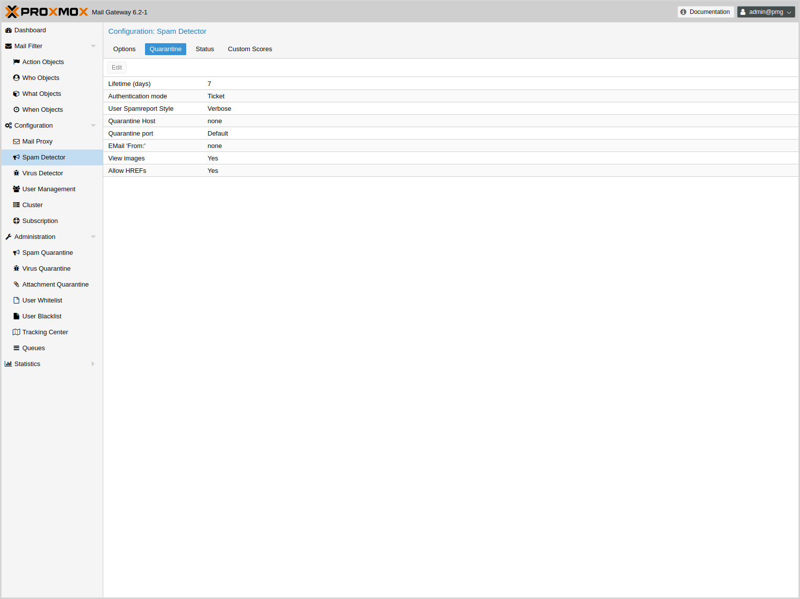
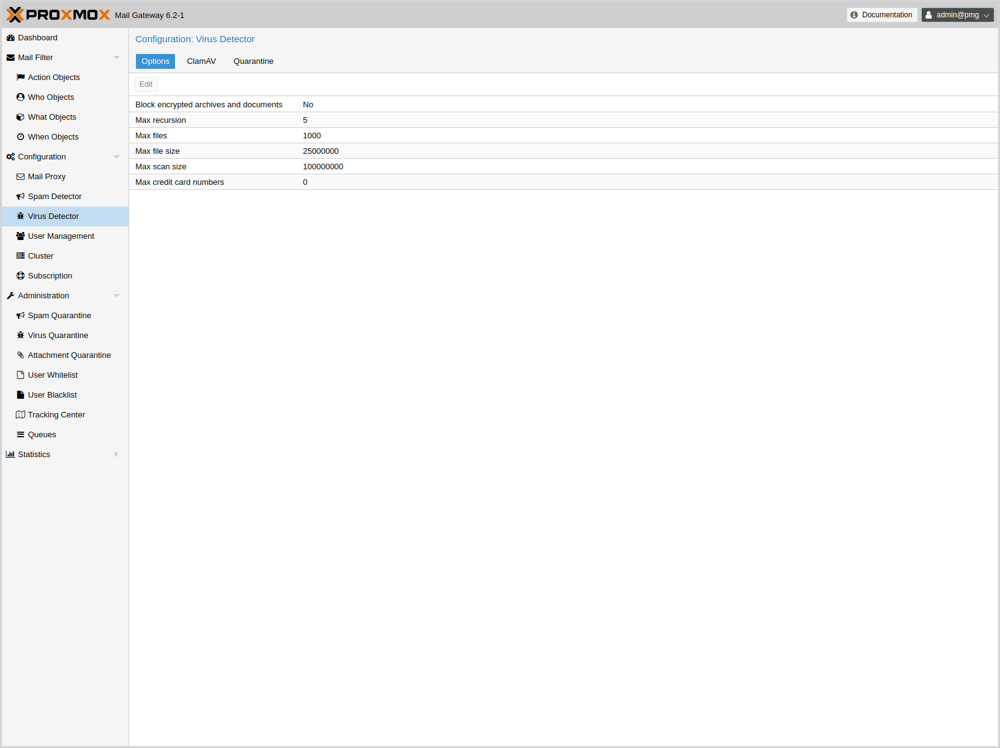
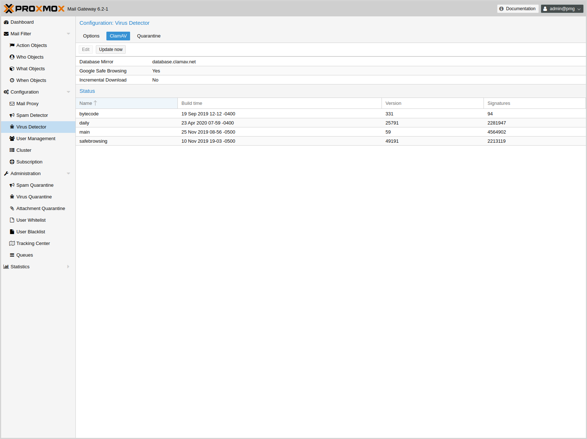
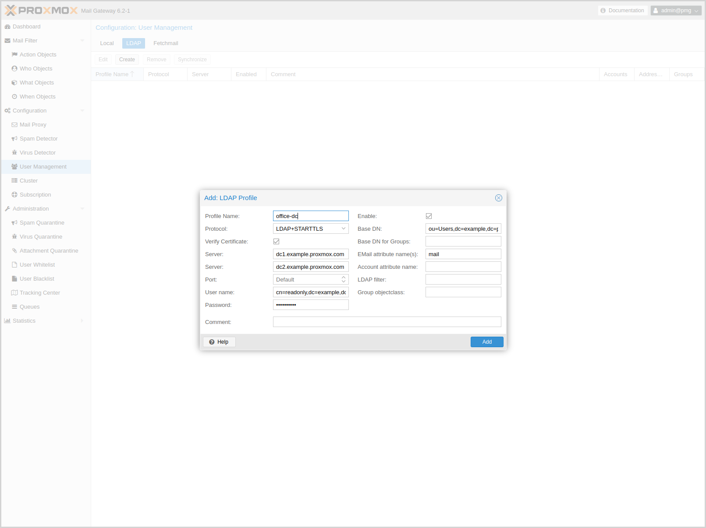

[[chapter_pmgconfig]]
ifdef::manvolnum[]
pmgconfig(1)
============
:pmg-toplevel:

NAME
----

pmgconfig - Proxmox Mail Gateway Configuration Management Toolkit

SYNOPSIS
--------

include::pmgconfig.1-synopsis.adoc[]

DESCRIPTION
-----------
endif::manvolnum[]
ifndef::manvolnum[]
Configuration Management
========================
:pmg-toplevel:
endif::manvolnum[]

{pmg} is usually configured using the web-based Graphical User
Interface (GUI), but it is also possible to directly edit the
configuration files, use the REST API over 'https'
or the command line tool `pmgsh`.

The command line tool `pmgconfig` is used to simplify some common
configuration tasks, i.e. to generate cerificates and to rewrite
service configuration files.

NOTE: We use a Postgres database to store mail filter rules and
statistic data. See chapter xref:chapter_pmgdb[Database Management]
for more information.

Configuration files overview
----------------------------

`/etc/network/interfaces`::

Network setup. We never modify this files directly. Instead, we write
changes to `/etc/network/interfaces.new`. When you reboot, we rename
the file to `/etc/network/interfaces`, so any changes gets activated
on the next reboot.

`/etc/resolv.conf`::

DNS search domain and nameserver setup.

`/etc/hostname`::

The system's host name.

`/etc/hosts`::

Static table lookup for hostnames.

`/etc/pmg/pmg.conf`::

Stores common administration options, i.e. the spam and mail proxy setup.

`/etc/pmg/cluster.conf`::

The cluster setup.

`/etc/pmg/domains`::

The list of relay domains.

`/etc/pmg/fetchmailrc`::

Fetchmail configuration (POP3 and IMAP setup).

`/etc/pmg/ldap.conf`::

LDAP configuration.

`/etc/pmg/mynetworks`::

List of local (trusted) networks.

`/etc/pmg/subscription`::

Stores your subscription key and status.

`/etc/pmg/tls_policy`::

TLS policy for outbound connections.

`/etc/pmg/transports`::

Message delivery transport setup.

`/etc/pmg/user.conf`::

GUI user configuration.

`/etc/mail/spamassassin/custom.cf`::

Custom {spamassassin} setup.

Keys and Certificates
---------------------

`/etc/pmg/pmg-api.pem`::

Key and certificate (combined) used be the HTTPs server (API).

`/etc/pmg/pmg-authkey.key`::

Privat key use to generate authentication tickets.

`/etc/pmg/pmg-authkey.pub`::

Public key use to verify authentication tickets.

`/etc/pmg/pmg-csrf.key`::

Internally used to generate CSRF tokens.

`/etc/pmg/pmg-tls.pem`::

Key and certificate (combined) to encrypt mail traffic (TLS).

Service Configuration Templates
-------------------------------

{pmg} uses various services to implement mail filtering, for example
the {postfix} Mail Transport Agent (MTA), the {clamav} antivirus
engine and the Apache {spamassassin} project. Those services use
separate configuration files, so we need to rewrite those files when
configuration is changed.

We use a template based approach to generate those files. The {tts} is
a well known, fast and flexible template processing system. You can
find the default templates in `/var/lib/pmg/templates/`. Please do not
modify them directly, because your modification would get lost on the
next update. Instead, copy them to `/etc/pmg/templates/`, then apply
your changes there.

Templates can access any configuration setting, and you can use the
`pmgconfig dump` command to get a list of all variable names:

----
# pmgconfig dump
...
dns.domain = yourdomain.tld
dns.hostname = pmg
ipconfig.int_ip = 192.168.2.127
pmg.admin.advfilter = 1
...
----

The same tool is used to force regeneration of all template based
configuration files. You need to run that after modifying a template,
or when you directly edit configuration files

----
# pmgconfig sync --restart 1
----

Above commands also restarts services if underlying configuration
files are changed. Please note that this is automatically done when
you change the configuration using the GUI or API.

NOTE: Modified templates from `/etc/pmg/templates/` are automatically
synced from the master node to all cluster members.

[[pmgconfig_systemconfig]]
System Configuration
--------------------

Network and Time
~~~~~~~~~~~~~~~~

ifndef::manvolnum[]

endif::manvolnum[]

Normally the network and time is already configured when you visit the
GUI. The installer asks for those setting and sets up the correct
values.

The default setup uses a single Ethernet adapter and static IP
assignment. The configuration is stored at '/etc/network/interfaces',
and the actual network setup is done the standard Debian way using
package 'ifupdown'.

.Example network setup '/etc/network/interfaces'
----
source /etc/network/interfaces.d/*

auto lo
iface lo inet loopback

auto ens18
iface ens18 inet static
	address  192.168.2.127
	netmask  255.255.240.0
	gateway  192.168.2.1
----

.DNS recommendations

Many tests to detect SPAM mails use DNS queries, so it is important to
have a fast and reliable DNS server. We also query some public
available DNS Blacklists. Most of them apply rate limits for clients,
so they simply will not work if you use a public DNS server (because
they are usually blocked). We recommend to use your own DNS server,
which need to be configured in 'recursive' mode.

Options
~~~~~~~

ifndef::manvolnum[]
image::images/screenshot/pmg-gui-system-options.png[]
endif::manvolnum[]

Those settings are saved to subsection 'admin' in `/etc/pmg/pmg.conf`,
using the following configuration keys:

include::pmg.admin-conf-opts.adoc[]

Mail Proxy Configuration
------------------------

[[pmgconfig_mailproxy_relaying]]
Relaying
~~~~~~~~

ifndef::manvolnum[]

endif::manvolnum[]

Those settings are saved to subsection 'mail' in `/etc/pmg/pmg.conf`,
using the following configuration keys:

include::pmg.mail-relaying-conf-opts.adoc[]

[[pmgconfig_mailproxy_relay_domains]]
Relay Domains
~~~~~~~~~~~~~

ifndef::manvolnum[]

endif::manvolnum[]

List of relayed mail domains, i.e. what destination domains this
system will relay mail to. The system will reject incoming mails to
other domains.

[[pmgconfig_mailproxy_ports]]
Ports
~~~~~

ifndef::manvolnum[]
image::images/screenshot/pmg-gui-mailproxy-ports.png[]
endif::manvolnum[]

Those settings are saved to subsection 'mail' in `/etc/pmg/pmg.conf`,
using the following configuration keys:

include::pmg.mail-ports-conf-opts.adoc[]

[[pmgconfig_mailproxy_options]]
Options
~~~~~~~

ifndef::manvolnum[]
image::images/screenshot/pmg-gui-mailproxy-options.png[]
endif::manvolnum[]

Those settings are saved to subsection 'mail' in `/etc/pmg/pmg.conf`,
using the following configuration keys:

include::pmg.mail-options-conf-opts.adoc[]

[[pmgconfig_mailproxy_transports]]
Transports
~~~~~~~~~~

ifndef::manvolnum[]

endif::manvolnum[]

You can use {pmg} to send e-mails to different internal
e-mail servers. For example you can send e-mails addressed to
domain.com to your first e-mail server, and e-mails addressed to
subdomain.domain.com to a second one.

You can add the IP addresses, hostname and SMTP ports and mail domains (or
just single email addresses) of your additional e-mail servers.

[[pmgconfig_mailproxy_networks]]
Networks
~~~~~~~~

ifndef::manvolnum[]

endif::manvolnum[]

You can add additional internal (trusted) IP networks or hosts.
All hosts in this list are allowed to relay.

NOTE: Hosts in the same subnet with Proxmox can relay by default and
it’s not needed to add them in this list.

[[pmgconfig_mailproxy_tls]]
TLS
~~~

ifndef::manvolnum[]

endif::manvolnum[]

Transport Layer Security (TLS) provides certificate-based
authentication and encrypted sessions. An encrypted session protects
the information that is transmitted with SMTP mail. When you activate
TLS, {pmg} automatically generates a new self signed
certificate for you (`/etc/pmg/pmg-tls.pem`).

{pmg} uses opportunistic TLS encryption by default. The SMTP transaction is
encrypted if the 'STARTTLS' ESMTP feature is supported by the remote
server.  Otherwise, messages are sent in the clear.
You can set a different TLS policy per desitination domain, should you for
example need to prevent e-mail delivery without encryption, or to work around
a broken 'STARTTLS' ESMTP implementation. See {postfix_tls_readme} for details
on the supported policies.

Enable TLS logging::

To get additional information about SMTP TLS activity you can enable
TLS logging. That way information about TLS sessions and used
certificate’s is logged via syslog.

Add TLS received header::

Set this option to include information about the protocol and cipher
used as well as the client and issuer CommonName into the "Received:"
message header.

Those settings are saved to subsection 'mail' in `/etc/pmg/pmg.conf`,
using the following configuration keys:

include::pmg.mail-tls-conf-opts.adoc[]

Whitelist
~~~~~~~~~

ifndef::manvolnum[]

endif::manvolnum[]

All SMTP checks are disabled for those entries (e. g. Greylisting,
SPF, RBL, ...)

NOTE: If you use a backup MX server (e.g. your ISP offers this service
for you) you should always add those servers here.

[[pmgconfig_spamdetector]]
Spam Detector Configuration
---------------------------

Options
~~~~~~~

ifndef::manvolnum[]

endif::manvolnum[]

{pmg} uses a wide variety of local and network tests to identify spam
signatures. This makes it harder for spammers to identify one aspect
which they can craft their messages to work around the spam filter.

Every single e-mail will be analyzed and gets a spam score
assigned. The system attempts to optimize the efficiency of the rules
that are run in terms of minimizing the number of false positives and
false negatives.

include::pmg.spam-conf-opts.adoc[]

[[pmgconfig_spamdetector_quarantine]]
Quarantine
~~~~~~~~~~

ifndef::manvolnum[]

endif::manvolnum[]

Proxmox analyses all incoming e-mail messages and decides for each
e-mail if its ham or spam (or virus). Good e-mails are delivered to
the inbox and spam messages can be moved into the spam quarantine.

The system can be configured to send daily reports to inform users
about the personal spam messages received the last day. That report is
only sent if there are new messages in the quarantine.

Some options are only available in the config file `/etc/pmg/pmg.conf`,
and not in the webinterface.

include::pmg.spamquar-conf-opts.adoc[]

[[pmgconfig_clamav]]
Virus Detector Configuration
----------------------------

[[pmgconfig_clamav_options]]
Options
~~~~~~~

ifndef::manvolnum[]

endif::manvolnum[]

All mails are automatically passed to the included virus detector
({clamav}). The default setting are considered safe, so it is usually
not required to change them.

{clamav} related settings are saved to subsection 'clamav' in `/etc/pmg/pmg.conf`,
using the following configuration keys:

include::pmg.clamav-conf-opts.adoc[]

ifndef::manvolnum[]

endif::manvolnum[]

Please note that the virus signature database it automatically
updated. But you can see the database status on the GUI, and you can
trigger manual updates there.

[[pmgconfig_clamav_quarantine]]
Quarantine
~~~~~~~~~~

ifndef::manvolnum[]

endif::manvolnum[]

Indentified virus mails are automatically moved to the virus
quarantine. The administartor can view those mails using the GUI, or
deliver them in case of false positives. {pmg} does not notify
individual users about received virus mails.

Virus quarantine related settings are saved to subsection 'virusquar'
in `/etc/pmg/pmg.conf`, using the following configuration keys:

include::pmg.virusquar-conf-opts.adoc[]

Custom SpamAssassin configuration
---------------------------------

This is only for advanced users. To add or change the Proxmox
{spamassassin} configuration please login to the console via SSH. Go
to directory `/etc/mail/spamassasin/`. In this directory there are several
files (`init.pre`, `local.cf`, ...) – do not change them.

To add your special configuration, you have to create a new file and
name it `custom.cf` (in this directory), then add your
configuration there. Be aware to use the {spamassassin}
syntax, and test with

----
# spamassassin -D --lint
----

If you run a cluster, the `custom.cf` file is synchronized from the
master node to all cluster members.

User Management
---------------

User management in {pmg} consists of three types of users/accounts:

[[pmgconfig_localuser]]
Local Users
~~~~~~~~~~~

Local users are used to manage and audit {pmg}. Those users can login on the
management web interface.

There are three roles:

* Administrator
+
Is allowed to manage settings of {pmg}, except some tasks like
network configuration and upgrading.

* Quarantine manager
+
Is allowed to manage quarantines, blacklists and whitelists, but not other
settings. Has no right to view any other data.

* Auditor
+
With this role, the user is only allowed to view data and configuration, but
not to edit it.

In addition there is always the 'root' user, which is used to perform special
system administrator tasks, such as updgrading a host or changing the
network configuration.

NOTE: Only pam users are able to login via the webconsole and ssh, which the
users created with the web interface are not. Those users are created for
{pmg} administration only.

Local user related settings are saved in `/etc/pmg/user.conf`.

For details of the fields see xref:pmg_user_configuration_file[user.conf]

[[pmgconfig_ldap]]
LDAP/Active Directory
~~~~~~~~~~~~~~~~~~~~~

You can specify multiple LDAP/Active Directory profiles, so that you can
create rules matching those users and groups.

Creating a profile requires (at least) the following:

* profile name
* protocol (LDAP or LDAPS; LDAPS is recommended)
* at least one server
* a user and password (if your server does not support anonymous binds)

All other fields should work with the defaults for most setups, but can be
used to customize the queries.

The settings are saved to `/etc/pmg/ldap.conf`. Details for the options
can be found here: xref:pmg_ldap_configuration_file[ldap.conf]

Bind user
^^^^^^^^^

It is highly recommended that the user which you use for connecting to the
LDAP server only has the permission to query the server. For LDAP servers
(for example OpenLDAP or FreeIPA), the username has to be of a format like
'uid=username,cn=users,cn=accounts,dc=domain' , where the specific fields are
depending on your setup. For Active Directory servers, the format should be
like 'username@domain' or 'domain\username'.

Sync
^^^^

{pmg} synchronizes the relevant user and group info periodically, so that
that information is available in a fast manner, even when the LDAP/AD server
is temporarily not accessible.

After a successfull sync, the groups and users should be visible on the web
interface. After that, you can create rules targeting LDAP users and groups.

[[pmgconfig_fetchmail]]
Fetchmail
~~~~~~~~~

Fetchmail is utility for polling and forwarding e-mails. You can define
e-mail accounts, which will then be fetched and forwarded to the e-mail
address you defined.

You have to add an entry for each account/target combination you want to
fetch and forward. Those will then be regularly polled and forwarded,
according to your configuration.

The API and web interface offer following configuration options:

include::fetchmail.conf.5-opts.adoc[]

ifdef::manvolnum[]
include::pmg-copyright.adoc[]
endif::manvolnum[]

